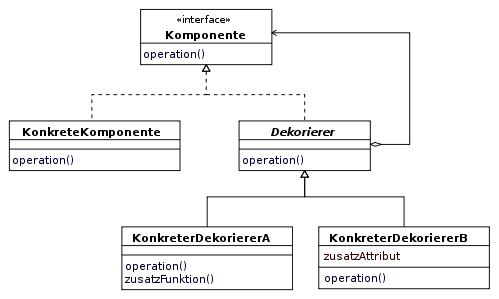
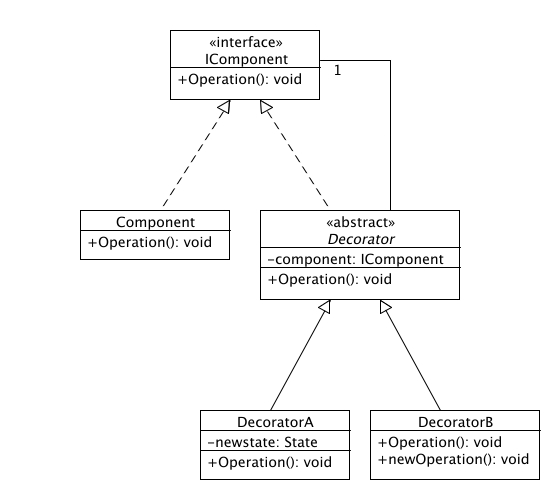
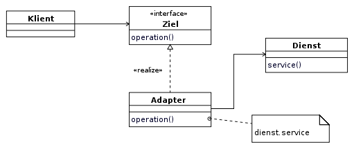
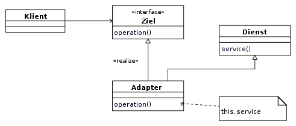
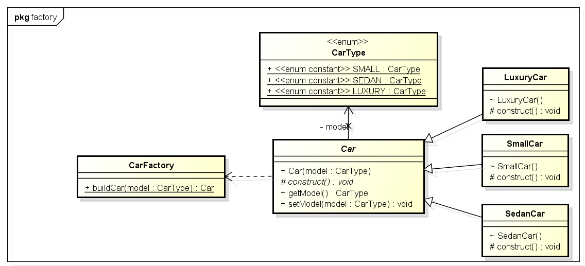
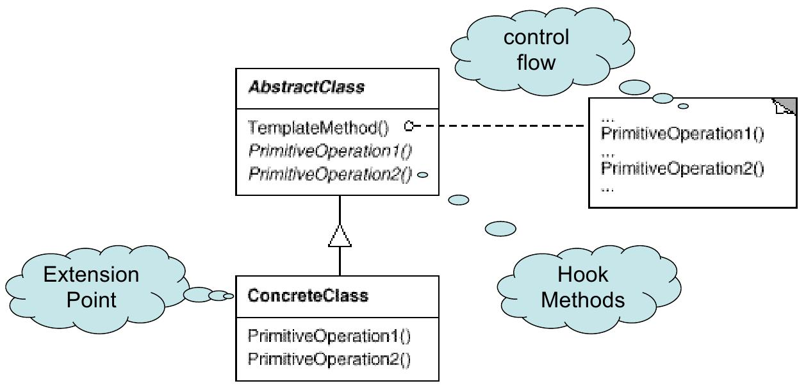
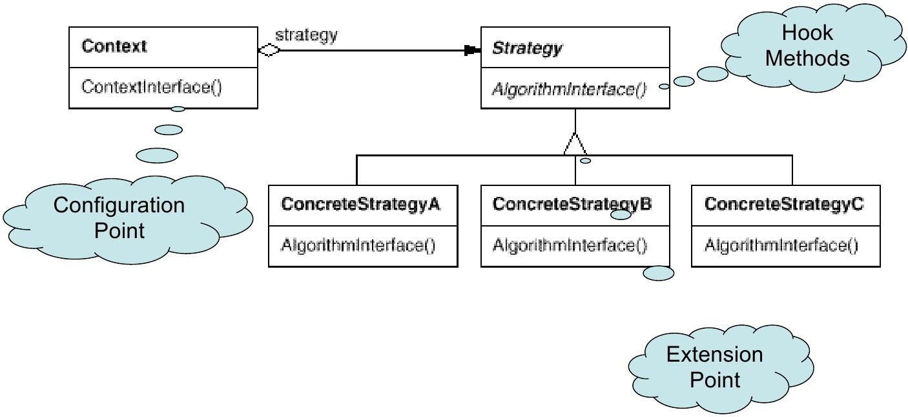
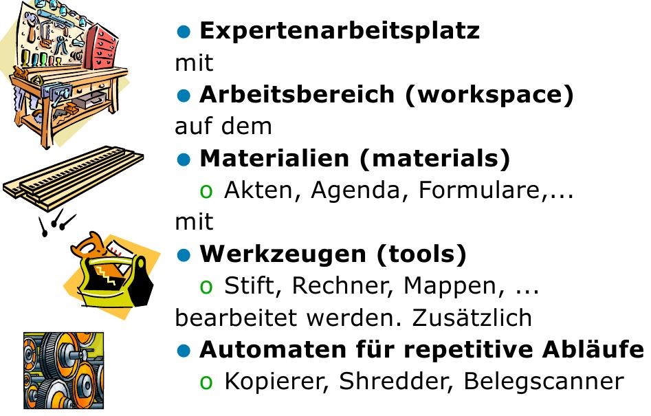

====================================================
Zusammenfassung mit wichtigen Themen für die Prüfung
====================================================

Patterns
========

Singleton
---------

Mögliche Alternativen, um einen Singleton abzulösen:

* Zugriff auf andere Komponenten der Applikation wird benötigt -> Context Objekt injecten
* Anzahl Instanzen muss kontrolliert werden -> CRTP Limit object count for a class
* Jeder muss Zugang zu einem Objekt habe, z.B. Settings. -> Als Objekt der Applikation anhängen, über Kontext darauf zugreifen, nach Möglichkeit Read-Only
* Monostate: Klasse mir nur static Member -> Keine oder beliebig viele Instanzen, spielt aber keine Rolle, State ist global
* Instanzkontrolle: Ist eigentlich eine Aufgabe der Applikation und nicht eines Typs

Iterator
--------

* Hohe Bindung zwischen Iterator und Collection
* Niedrige Bindung zwischen Iterator und Verwendung

.. code-block:: java

	ArrayList<String> alist = new ArrayList<String>();
	// . . . Add Strings to alist

	for (Iterator<String> it = alist.iterator(); it.hasNext(); ) {
		String s = it.next();
	}
	
	
	/**
	 * Iterator
	 */
	public class MyIterator <T> implements Iterator<T> {
		private int position = 0;
		private MyCollection<T>;
		
		public void Iterator(MyCollection<T> col) { this.Collection = col; }
		
		public bool hasNext() {
			return this.collection.size() > this.position+1;
		}
		
		public T next() {
			this.position++;
			return this.collection.get(this.position);
		}
	}
	
	/**
	 * Collection
	 */
	 public class MyCollection<E> implements Iterable<E>{
		public Iterator<E> iterator() {
			return new MyIterator<E>(this);
		}
	}

	
Decorator
---------

* Erweitert das Verhalten gleichartiger Objekte
* Zeichnet sich aus durch eine 1-zu Beziehung zwischen dem Komponenteninterface und dem Dekorierer (Composite hat eine *-zu Beziehung)

   

Beispiel (Quelle Wikipedia, portiert nach Java):

.. code-block:: java

	public abstract class Spielfigur {
		public abstract void drohe();
	}
	
	public class Monster extends Spielfigur {
		public override void drohe() { System.out.println("Grrrrrrrrrr."); }
	}
	
	public abstract class Dekorierer extends Spielfigur {
		private Spielfigur meineFigur;
	
		public Dekorierer(Spielfigur s)	{ meineFigur = s; }	
		public override void drohe() { meineFigur.drohe(); }
	}
	
	public class HustenDekorierer extends Dekorierer {
		public HustenDekorierer(Spielfigur s) { supter(s); }	
		public override void drohe() { 
			System.out.println("Hust, hust. ");
			super.drohe();
		}
	}
	
	public class SchnupfenDekorierer extends Dekorierer {
		public SchnupfenDekorierer(Spielfigur s) { super(s); }	
		public override void drohe() {
			System.out.println("Schniff. ");
			super.drohe();
		}
	}
	
	public class ClientCode {
		public static void Main(String[] args) {
			Spielfigur meinMonster = new Monster();
			meinMonster.drohe();
		
			Spielfigur meinVerhustetesMonster = 
				new HustenDekorierer(meinMonster);
			meinVerhustetesMonster.drohe();
		
			Spielfigur meinVerschnupftesMonster = 
				new SchnupfenDekorierer(meinMonster);
			meinVerschnupftesMonster.drohe();
		
			Spielfigur meinVerschnupftesVerhustetesMonster = 
				new SchnupfenDekorierer(new HustenDekorierer(meinMonster));
			meinVerschnupftesVerhustetesMonster.drohe();
		
			Spielfigur meinVerhustetesVerschnupftesMonster = 
				new HustenDekorierer(new SchnupfenDekorierer(meinMonster));
			meinVerhustetesVerschnupftesMonster.drohe();
		}
	}
	
	
Adapter
-------

* Verändert im Unterschied zum Decorator die Schnittstelle existierender Objekte

   
   

   
   
.. code-block:: java

	// Adapter to use a given numberSorter with arrays instead of lists

	/* 
	 * This is our adaptee, a third party implementation of a 
	 * number sorter that deals with Lists, not arrays.
	 */
	public class NumberSorter {
		public List<Integer> sort(List<Integer> numbers) {
			//sort and return
			return new ArrayList<Integer>();
		}
	}

	//this is our Target interface
	public interface Sorter {
		public int[] sort(int[] numbers);
	}

	public class SortListAdapter implements Sorter {
		@Override
		public int[] sort(int[] numbers) {
			//convert the array to a List
			List<Integer> numberList = new ArrayList<Integer>();
			
			//call the adapter 
			NumberSorter sorter = new NumberSorter();
			numberList = sorter.sort(numberList);
			
			//convert the list back to an array and return 
			
			return sortedNumbers;
		}
		
	}
	
	public class Client {
		public static void main(String[] args) {
			int[] numbers = new int[]{34, 2, 4, 12, 1};

			Sorter sorter = new SortListAdapter();
			sorter.sort(numbers);
		}
	}
	
	
Factories
---------

.. code-block:: java

	interface CarFactory {
		// typical factory method: create...()
		public Car createCar();
	}	
	
	interface Car {
		public class getType();
	}
	
	/* 
	 * Concrete implementations of the factory and car 
	 */	
	class SedanFactory implements CarFactory {
		public Car createCar() {
			return new Sedan();
		}
	}
	
	class Sedan implements Car {
		public class getType() {
			return this.getClass();
		}
	}
	
	/* Client */
	public class Client {
		public static void main(String[] args) {
			Factory factory = new SedanFactory();
			Car car = factory.createCar();
			System.out.println(car.getType().getName());
		}
	}

Pattern Anwendung
=================

Pattern Combinations
--------------------

Häufig anzutreffende Pattern Kombinationen:

* Visitor und Composite (Visitors traversiert Composite-Struktur)
* Flyweight und Composite
* Strategy und NullObject (Defaultstrategy)
* Iterator und NullObject (Default Verhalten für Collections)
* Memento und Command (Undo)
* Template Method und Strategy (Flexibilisierung der Template Method)
* Prototype und Factory Method (Factory erstellt Objekte anhand von Bestehenden -> Prototype)

Kontrolle über Instanzen (Anzahl minimieren)
--------------------------------------------

* Identität spielt untergeordnete Rolle
* Flyweight
* Mutable Compaion

	
	
Values
======

ValueObject oder String?
------------------------

Soll eine ISBN Nummer ein eigener Datentyp sein oder String? Wenn interner Aufbau unwichtg:
String, wenn Aufbau, Validation und Korrektheit wichtig: ISBN-Type

ValueObject
-----------

hashCode(), equals und ev. Serializable implementieren

.. code-block:: java

	public class ISBN {
		private String isbn;
		
		private static bool isValidISBN(String isbn) {
			return ...
		}
		
		public void ISBN(String isbn) {
			if(ISBN::isValidISBN(isbn) {
				this.isbn = isbn;
			} else {
				this.isbn = null;
			}
		}
		
		// pseudo call-by-value
		public String getISBN() { return new String(this.isbn); }
		
		public boolean equals(Object rhs) {
			return rhs instanceof ISBN && rhs.equals(ISBN);
		}
		
		public boolean equals(ISBN isbn) {
			return this.isbn.equals(isbn.getISBN());
		}
		
		public int hashCode() {
			return this.isbn.hashCode();
		}
		
		// if needed: implement Serializable
	}
	
	
* Für rechenbare Value Objects: Verkettungsmöglichkeit implementieren (return new Element statt Seiteneffekt)

Frameworks
==========

Unterschied zwischen Library & Framework
----------------------------------------

Library
	wird von Applikation aufgerufen
FW
	* ruft Applikationscode auf (Don't call us, we call you)
	* Inversion of Control
	* Ist ein Programmskelett
	

Micro-Frameworks
----------------

Tenplate Method
...............

* Beim Schablonenmethoden-Entwurfsmuster wird in einer abstrakten Klasse das Skelett eines Algorithmus definiert. Die konkrete Ausformung der einzelnen Schritte wird an Unterklassen delegiert. Dadurch besteht die Möglichkeit, einzelne Schritte des Algorithmus zu verändern oder zu überschreiben, ohne dass die zu Grunde liegende Struktur des Algorithmus modifiziert werden muss. Die Schablonenmethode (engl. template method) ruft abstrakte Methoden auf, die erst in den Unterklassen definiert werden. Diese Methoden werden auch als Einschubmethoden bezeichnet.
* Extension point: Hook methods der Abstrakten Klasse
* Framework code: TemplateMethod();
* Application Code: AbstractOP() in Abstr. Klasse + Konkrete Klasse mit Implementation

     
  
Strategy
........

* Extension point: AlgorithmInterface()
* Framework code: Context + Strategy
* Application code: AlgorithmInterface() in Strategy + konkrete Strategien mit Implementation

   
Command Processor
.................

* Extension point: do(), undo(), ...
* Framework code: Command processor, Controller, Abstract Command
* Application code: do(), undo() in Abstract Command + konkrete Command Implementation + Supplier

.. image:: img/4.6.jpg
   :width: 75 %

WAM
---

Werkzeuge
	* Identität, Name, Repräsentation
	* Bearbeitet oder betrachtet Material um bestimmte Aufgabe durchzuf.
	* unterstützt wiederk. Tätigkeiten
	* Wird benutzt und wieder zur Seite gelegt
	
(Fach)behälter
	* Beinhaltet, verwaltet, ordnet Materialien
	* Speichert gleichartige oder definierte Menge unterschiedlicher Objekte	
	* Repräsentiert oft einen Arbeitablauf und Sammelt dazu die Objekte
	
Material
	* virtueller Gegenstand
	* werden mit WZ und Autmaten bearbeitet
	* repr. Domänenspez. Konzepte
	* Muss sich für spez. Aufgabe eignene
	* Können über Ein- und Ausgänge an andere Experten weitergeleitet werden
	
Experte
	* Bedient System, richtet sich seinen Arbeitsplatz ein

Automat
	* Erledigt Routineaufgaben
	* Benutzt und bearbeitet Materialien -> liefert Resultat
	* Arbeiten im Hintergrund
	* Menschliche Eingriffe: Starten, Zustandsabfrage
	
Work Environment (Arbeitsumgebung)
	* Ort, an dem Werkzeuge, Materialien und andere Objekte bereitliegen -> sind Domänenspez. arangiert
	* Beinhaltet Bereiche, die vom Arbeitsplatz (Desktop) aus erreichbar sind
	* In 1-Benutzer System identisch mit Arbeitsplatz
	
Fachwerte
	* Date, Currency, Range, ...
	
Workspace (Arbeitsplatz, Desktop)
	* Hier werden bestimmte Aufgaben erledigt
	* Vor Zugriff dritter geschützt

	