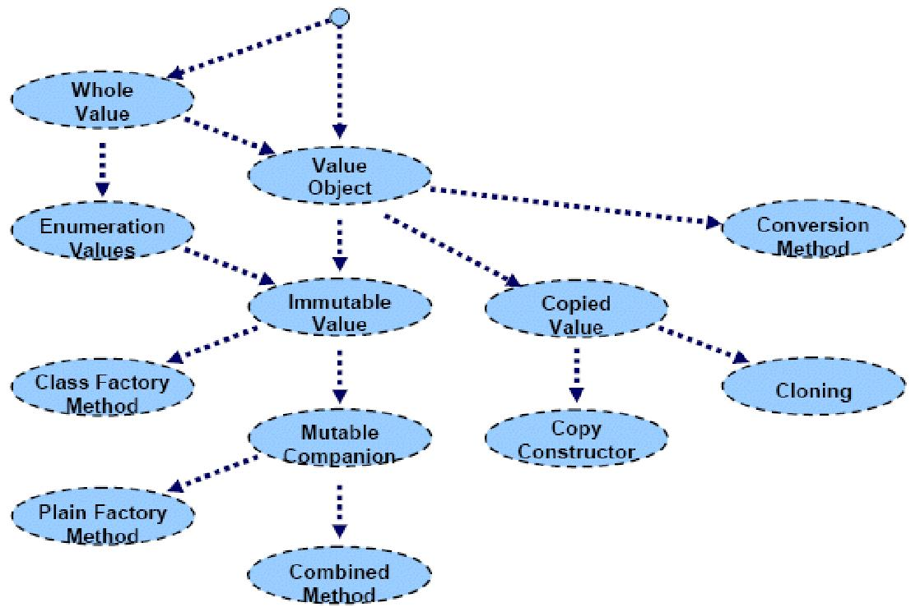

==========================
FS14 APF Repetitionsfragen
==========================

Antworten zu den Repetitionsfragen
==================================
Falls vorhanden befinden sich diese im GitHub Repository. Ergänzungen oder ganze Antwortensets sind jederzeit herzlich willkommen. https://github.com/moonline/HSR.modules.APF

Symbolerklärung
===============
**[DP]**
Wissensfragen des Dozenten (Slides) für die Prüfung

**[EW]**
Wissensfrage, die über den Stoff der Vorlesung hinaus geht.

1 Patterns Allgemein
====================

**1.0.1.**
Was sind Patterns? Was zeichnen sie aus?

**1.0.2.**
Welche Inhalte beinhaltet eine gute Pattern Beschreibung?

**1.0.3.**
Warum sind KIS, DRY, SOLID, ... keine Patterns? Was grenzt sie von Patterns ab? Nennen sie zudem zwei Arten von Pattern-Ähnlichen Beschreibungen, die keine Patterns sind.

**1.0.4.**
Welche Arten von Patterns gibt es?

**1.0.5.**
Kommentieren Sie den Satz: "No Pattern is an Island".

2 Patterns
==========

**2.0.1.**
Erklären Sie die folgenden Patterns. Nennen Sie zu jedem
	i) Problemstellung
	ii) Lösung
	iii) Vor- / Nachteile
	iv) Verwandtschaften zu ähnlichen Patterns / Abgrenzung
	v) Einsatzbeispiele
	
a) Flyweight
b) Memento
c) Mediator
d) Visitor
e) Command
f) Iterator
g) Enumeration Method
h) Batch Method
i) State Pattern
	1) Object for States
	2) Methods for State
	3) Collections for States
	

3 Frameworks
============

**3.0.1.**
Was bringen Frameworks? Warum werden sie entwickelt und warum sollte man sie einsetzen?

**3.0.2.**
Was ist ein Framework überhaupt?

**3.0.3.**
Was ist ein Application Framework?

**3.0.4.**
Wie unterscheidet sich Framework und Bibliothekt? Skizzieren Sie den Aufruf, bzw. woher ihre Klasse die Schnittstelle hat.

**3.0.5.**
Wie funktionieren Framework Callbacks? Was ist das Konzept dahinter?

**3.0.6.**
Was sind Hooks? Was erlaubt ihnen das Framework damit?

**3.0.7.**
Was sind Micro-Frameworks?

**3.0.8.**
Warum sind die Patterns "Template Method", "Strategy", "Command Processor" und "Decoration" "Micro Frameworks"?

4 ValueObject
=============

**4.0.1.**
Was sind Values?

**4.0.2.**
Wo ist der Unterschied zwischen Value und Object?

**4.0.3.**
Michael Jackson definiert "Events", "Entities" und "Values". Erklären Sie die Begriffe und nennen Sie Beispiele.

**4.0.4.**
Kevlin Henney definiert "Entities", "Services", "Values" und "Tasks" als Objektkategorien. Erklären Sie die Begriffe und nennen Sie Beispiele.

**4.0.5.**
Erklären Sie die Objektcharakteristik "identity", "state" und "behaviour".

**4.0.6.**
Was sind Value Objects?

**4.0.7.**
Ein Buch (Author, Title, ISBN) besitzt eine ISBN Nummer. In welchem Fall ist es sinnvoller, die ISBN Nummer als String abzulegen und in welchem Fall ist es sinnvoller, dafür einen eigenen Typ zu definieren?

**4.0.8.**
In welchem Fall macht der Einsatz von Value Types in OO Sprachen Sinn?

**4.0.9.**
Welches Verhalten sollten Values bei equality ( .equals(..) ) aufweisen im Unterschied zu Objekten?

**4.0.10.**
Warum macht es bei Values keinen Unterschied, ob sie kopiert oder per Referenz übergeben werden?

**4.0.11.**
Welchen Vorteil bieten Values, was die Persistence angeht?

**4.0.12.**
Erklären Sie die Value Patterns:

**4.0.13.**
Welches Problem löst "Whole Value"?

**4.0.14.**
Was ist ein "Value Object"? Wann wird es gebraucht? Wie wird in Java und C++ ein "Value Object" implementiert?

**4.0.15.**
Erklären Sie "Class Factory Method". Wozu dient das Pattern?

**4.0.16.**
Wie kann in einer Sprache die auf "Call by Reference" basiert, "Copied Value" umgesetzt werden? Wie kann allgemein verhindert werden, das ein übergebenes Objekt verändert wird? Machen Sie Beispiele für C++ und Java.

**4.0.17.**
Erklären Sie den Unterschied zwischen "Cloning" und "Prototype".

**4.0.18.**
Welche Idee verbirgt sich hinter dem Kopierkonstruktor?

**4.0.19.**
Was sind "Immutable Values" und "Immutable Companion"?

**4.0.20.**
Was ist "Mutable Companion"?

5 Reflection
============

**5.0.1.**
Was ist Reflection?

**5.0.2.**
Welche Probleme löst Reflection?

**5.0.3.**
Was sind Metaobjects?

**5.0.4.**
Skizzieren Sie das Reflection Pattern.

**5.0.5.**
Was sind Introspection und Intercession? Warum bieten viele Sprachen nur Introspection?

**5.0.6.**
Nennen Sie einige Sprachfeatures wie z.B. Polymorphism, die auf Reflection oder Reflection ähnliche Prozesse setzen.

**5.0.7.**
Wo werden Reflectionmechanismen eingesetzt? Machen Sie ein Paar Beispiele.

**5.0.8.**
Was ist ein TypeObject?

