================
FS14 Summary APF
================

0 Allgemeine Infos
==================

* Prüfung: Openbook

1 Patterns
==========

* Verhaltens/Designmuster, Engineeringstories (mehrfach erfolgreiche)
* Was sich bewährt hat und reproduzierbar ist
* Patterns werden nicht erfunden (höchstend entdeckt) sondern im Rahmen einer Erfindung angewendet!
* Namen der Klassen bei Patterns bezeichnen Rollen, keine konkreten Klassennamen
* Patterns sind praktische Tools aber keine Allerweltsheilmittel und nicht für Anfänger geeignet
* **Definition** Patterns sind das Medium um das How-To Wissen zu kommunizieren
* Patterns können Freiheitsgrade enthalten (bewusste Variantenentscheidung)
* Patterns können Beziehung zu andern Patterns enthalten

1.1 Zusammensetzung Pattern
---------------------------

* Wie's gemacht wird
* Beschreibung
	* Name (Ermöglicht das Reden darüber, man weiss was gemeint ist)
	* Problem
	* Einflussfaktoren, die das Problem schwierig machen
	* Probleme, die immer wieder auftreten
	* Lösung (Forces)
	* Vor- und Nachteile (Trade-of's -> Konsequenzen) -> Lohnt es sich überhaut für einen konkreten Fall das Pattern anzuwenden?
	
	
1.1.1 Gute Patternbeschreibung
------------------------------

* Gute Patterns diskutieren auch deren Nachteile
* Gute Patterns beschreiben eine wiederholbar mehrfach erfolgreiche Vorgehensweise
	

1.2 Abgrenzung
--------------

* Allgemeine Vorgehensweisen wie KIS, SOLID oder DRY sind keine Patterns!
* Dinge, die nur einmal funktionieren / funktioniert haben
* Algorithmen, Prozesse, Kochrezepte, ... sind keine Patterns.
* Lösungen ohne Probleme
* Probleme ohne Lösungen
* Patterns sind keine fertigen Lösungen
	

1.3 Pattern Übersicht
---------------------

.. image:: img/1.1.jpg

1.4 Pattern Beziehungen
-----------------------

a) Refinement: Pattern basiert auf Implementation eines Anderen
b) Variation: Pattern zeigt Alternative oder Variante eines andern Patterns
c) Spezialisierung: Pattern ist spezielle Variante eines generischen
d) Setting Context: Pattern ist Voraussetzung für Anderes

2 GoF Patterns
==============

2.1 Flyweight
-------------

* Vermeiden von mehrfachem Vorkommen von gleichartigen Objekten, die sich nie ändern. -> Platz sparen.
* Viele Objekte beschäftigen den GC.
* Heap wird von allen Threads gemeinsam genutzt

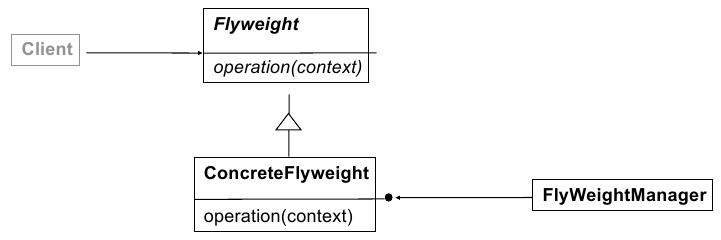

   Flyweight Pattern (Einfach)
   
   
* Flyweightmanager gibt bei der Anforderung z.B. eines A (Char Object) nicht ein neues sondern ein bestehendes.
* Das Sharing funktioniert nur, wenn die Objekte konstant sind (sich nicht verändern) (intrinsicState)
	* C++: member const machen
	* Java: fields final machen
* Client ruft nie selbst "new" auf sondern geht immer über den Manager

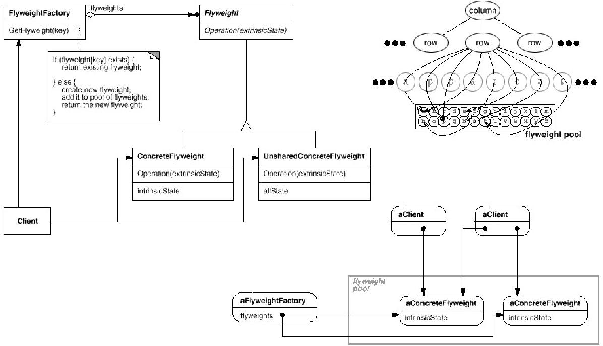

   Flyweight extended.
   
   
* UnsharedConcreteFlyweight werden nicht im Pool abgelegt sondern ganz normal verwendet
* Vorteile: Anzahl Objekte werden reduziert
* Nachteil: 
	* Objekte können nicht mehr anhand der Referenz unterschieden werden.
	* Flyweightmanager wird benötigt
* Praxisanwendungen: AWT

2.2 Memento
-----------

* Speichern des internen Zustandes eines Objektes zur späteren verwendung.
* Wie kann dieser interne Zustand verwendet werden ohne die Kapselung zu verletzen?
* Undo, Versionsverwaltungen

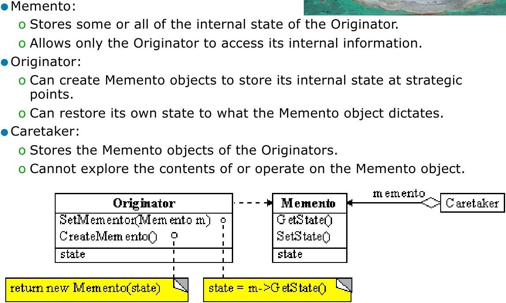

   Memento Pattern. Saubere Kapselung wird erreicht duch stärkere Kopplung zwischen Memento und Originator.

* Alternativen: Objekt klonen, Reflection, Changes protokollieren.
* Schmalspur-Memento: Erinnerungsinformation reicht nicht aus um das Objekt zurückzusetzen, jedoch um zu erkennen, das es sich geändert hat (Bsp. Java Collection Iterator Change detection).
* Vorteile: Kapselung bleibt erhalten
* Nachteile:
	* Zustand kann ncith direkt inspiziert werden
	* Vollständige Kopie, keine Diffs
	* Speicherverbrauch

2.3 Mediator
------------

* Vermittler
* Wenn's zuviele gibt, die einander benachrichtigen wollen
* Kommunikation unter Objekten ohne das diese sich gegenseitig kennen müssen
* Observer ist eine Implementationsform des Mediators

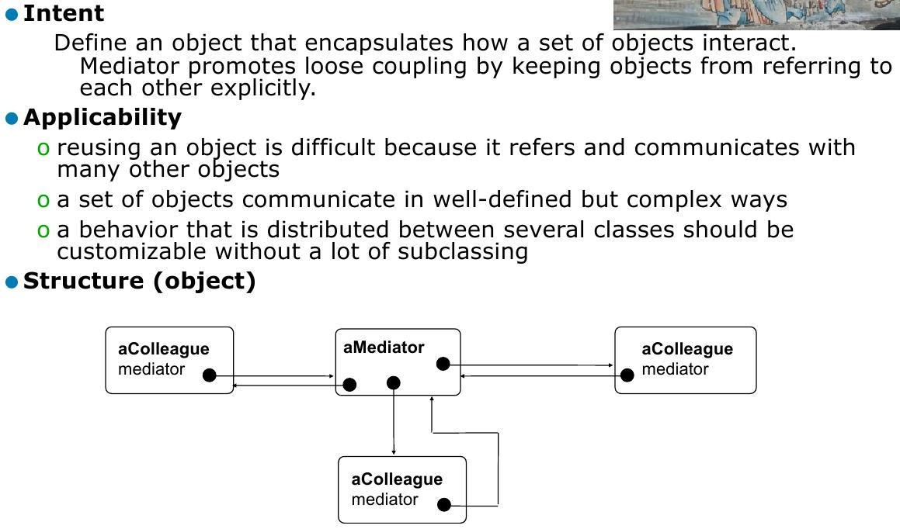

   Mediator

* Mediator kennt alle Kommunikationspartner, Partner kennen sich jedoch nicht untereinander
* Bei Implementation des Mediators muss man aufpassen, das er nicht zu viele Abhängigkeiten besitzt.
* Vorteile: 
	* Einzelne Teilnehmer sind einfach austauschbar (Kopplung reduziert)
	* Einzelne Partner müssen sich nicht direkt kennen.
	* Mediator leistet Korrdination (Priorisierung, Filterung)
	* Zentrale Kontrolle
* Nachteile:
	* Soll die Kontrolle verändert werden, muss der Mediator umgebaut werden
	* Fällt der Mediator aus, ist die Kommunikation down

2.4 Visitor
-----------

Composite Pattern:

::

	      .-----.
	      | op()| *
	      |_____|<--------.
	       ^   ^          |
	      /     \         |
	.-----.     .-----.   |
	| op()|     |op() |<>-'
	|_____|     |_____|

* Kindelemente können anstelle parent verwendet werden -> Parent führt Liste mit Childs und rift auf diesen eine Funktion auf.
* Erweiterung von Funktionalität ist aufwendig beim Composite -> daher Visitor

.. note:: Visitor: Kapsle eine auf den Elementen einer Objektstruktur auszuführende Operation als ein Objekt. Das Besuchermuster ermöglicht es Ihnen, eine neue Operation zu definieren, ohne die Klasse der von ihr bearbeiteten Elemente zu ändern

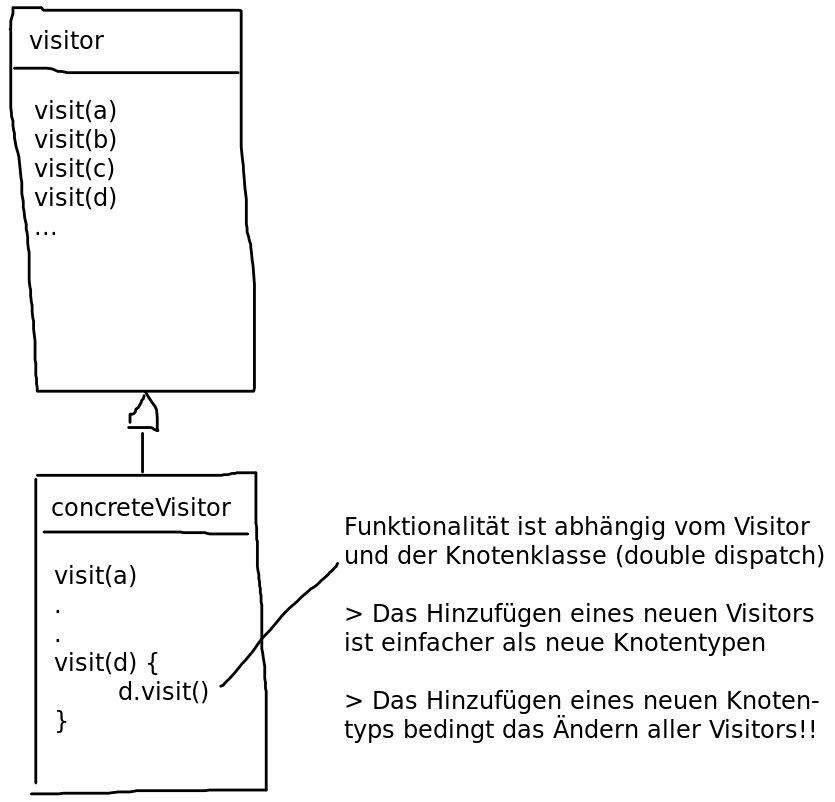

   Visitor Pattern
   
   
* Visitor lohnt sich nur, wenn sich die Knotentypen kaum ändern.
* Anwendungsfall: Compilerbau

2.5 Command
-----------

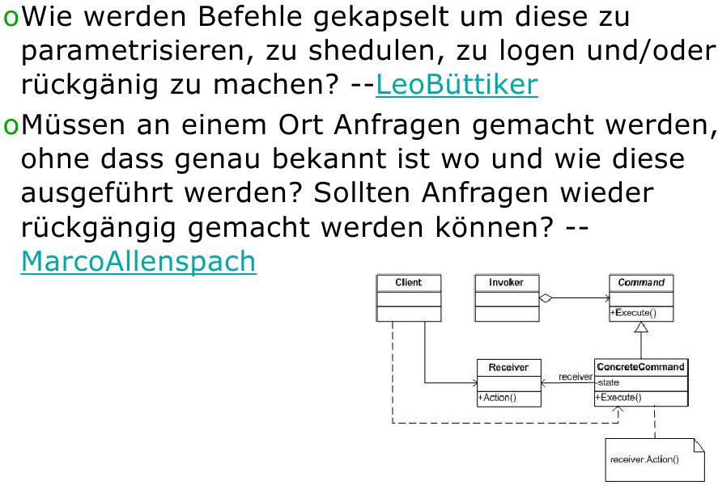
	

* Kapselung einer Funktion als Objekt
* Ojekt wird jemand anderem mitgegeben statt direkt ausgeführt
* Vorteile: 
	* Command Objekte lassen sich speichern und wiederverwenden
	* Objekt kann an mehreren Stellen verwendet werden
	* Neue Commands lassen sich einfach hinzuzufügen zur App
	* Commands können aufgezeichnet und wieder abgespielt werden -> makro, undo
	
------------

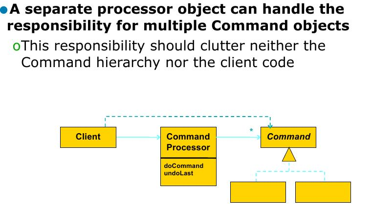

   Command Processor

   
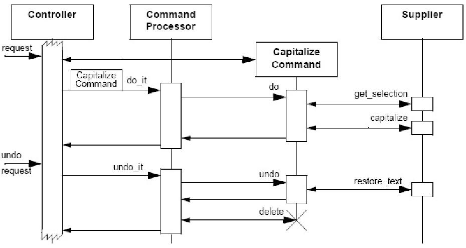

2.6 Patterns, die zusammen vorkommen können
===========================================

* Visitor und Composite
* Flyweight und Composite
* Memento und Command

.. warning:: Mögliche Prüfungsfrage

3 Beyond GoF Patterns
=====================

3.1 Iterator
============

.. figure:: img/3.1.jpg

* Über Elemente iterieren können ohne deren internen Aufbau zu kennens
* Iterator muss sehr eng gekoppelt sein mit dem zu iterierenden Objekt, dafür ist Kopplung zum Iterierenden schwach

.. warning:: An Prüfung Code als Iterator erkennen können.

* Robuste Iteration (wenn sich Collection verändert hat) ist schwierig umzusetzen
* Iteratorobjekt ist entkoppelt und kriegt möglicherweise nicht mit, wenn sich Collection ändert (c++ -> undefined behaviour)

3.2 Enumeration Method
======================

* Teil des Iterator Pattern
* z.B. .each()
* An die aufrufende Methode wird ein Command Objekt weitergegeben, das die Iteration übernimmt.
* Keine Kopplung vom Command Objekt zur Collection

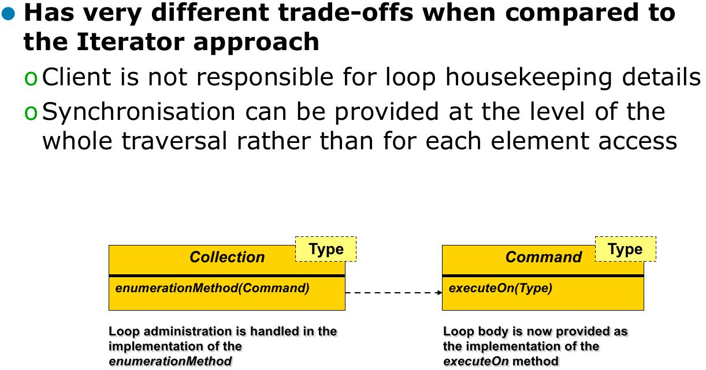

3.3 Batch Method
================

* Wenn Collection auf Server und Iterator auf CLient -> Problem mit Latenz bei jeder Iteration
* -> Collection wird in Häppchen übertragen und während lokal iteriert wird bereits das nächste Häppchen nachgeladen

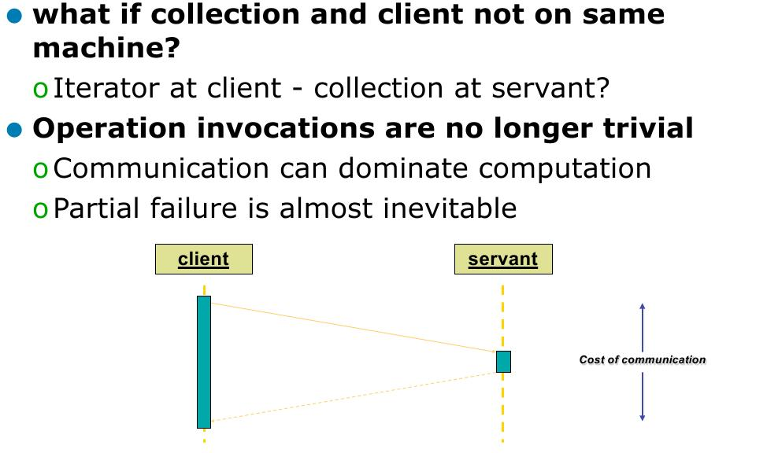

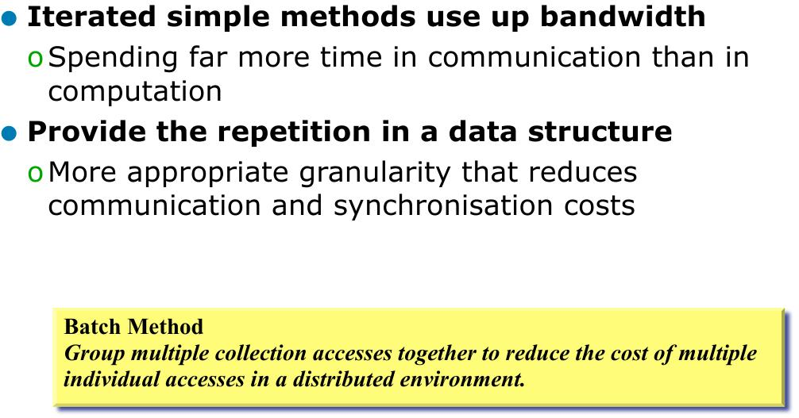

3.4 State
=========

3.4.1 Objects for States (GoF)
------------------------------

* Ein Objekt kann sein Verhalten ändern, in dem ein Teil des Verhaltens ausgelagert wird in ein referenziertes Objekt, das ausgetauscht werden kann.
* Unterschied zu Strategy: Beim State Pattern wechselt die States automatisch, beim Strategy muss man die Strategy wählen

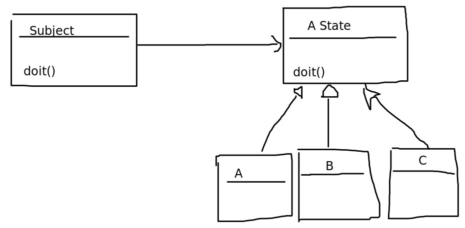
   

* Klassen, die von der State ableiten (a,b,c) besitzen keine eigenen Daten (stateless)

2.4.2 Methods for States (Tabellen)
-----------------------------------

* Alternativen: States lassen sich auch mit Statetables umsetzen
	* Bsp: Compiler setzt Switch als Sprungtabelle um

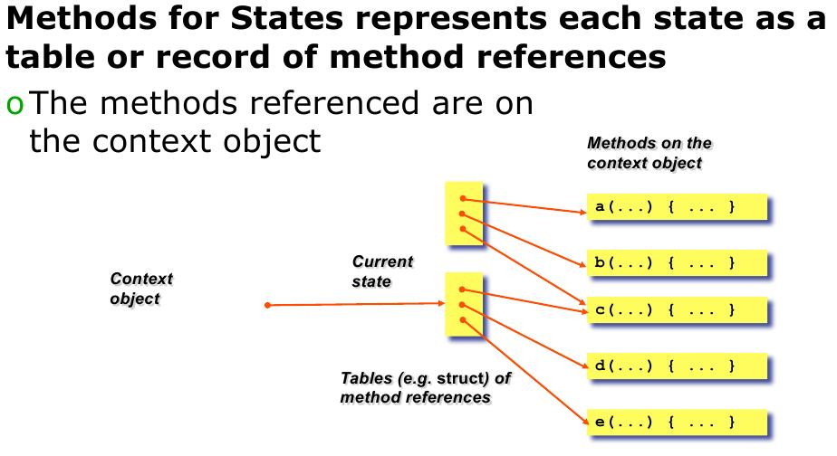

* Vorteil: Methoden, die nichts machen können einfach als Null-Object abgelegt werden

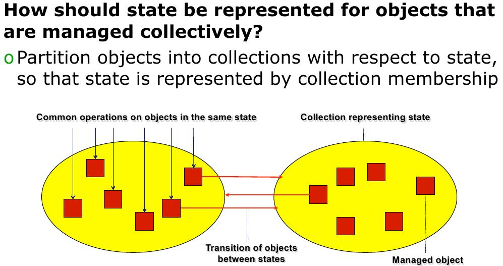

2.4.3 Collections for States
----------------------------

* Objekte werden zu Häufchen zugeordnet und darüber entscheidet sich deren Verhalten.
* -> Zugehörigkeit eintscheidet Verhalten

.. important:: Selbstlesestoff zu State

4 Frameworks
============

* OO Klassen, die zusammen arbeiten
* Erweiterungspunkte
* FW ist meisst halbfertig -> Erweiterungspunkte
* Unterschied zu Bibliothek: Framework ruft meinen Code auf, nicht ich rufe die Bibliothek auf
	* -> Inversion of Control
* Framework ist Programmskelett

.

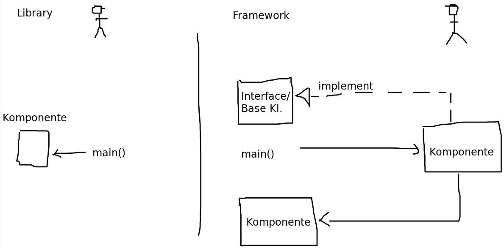

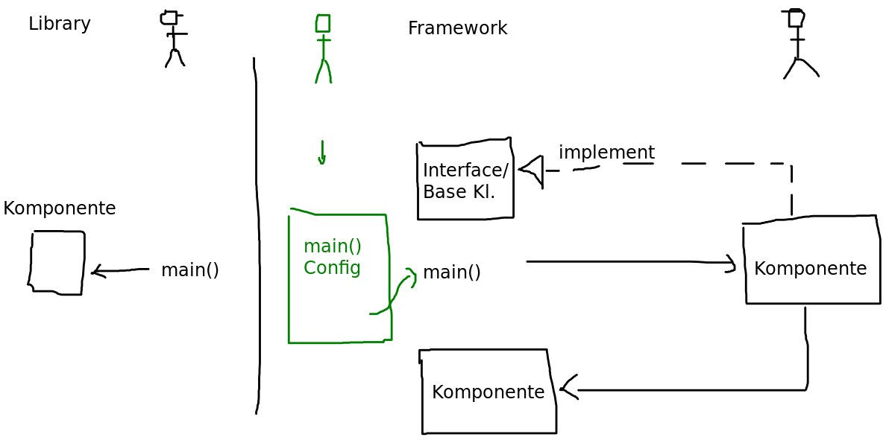

   Framework mit vorgelagerter Config und selbst impleentierter main Funktion

.. warning:: Unterschied Lib / FW und Eigenschaften FW kommt an der Prüfung

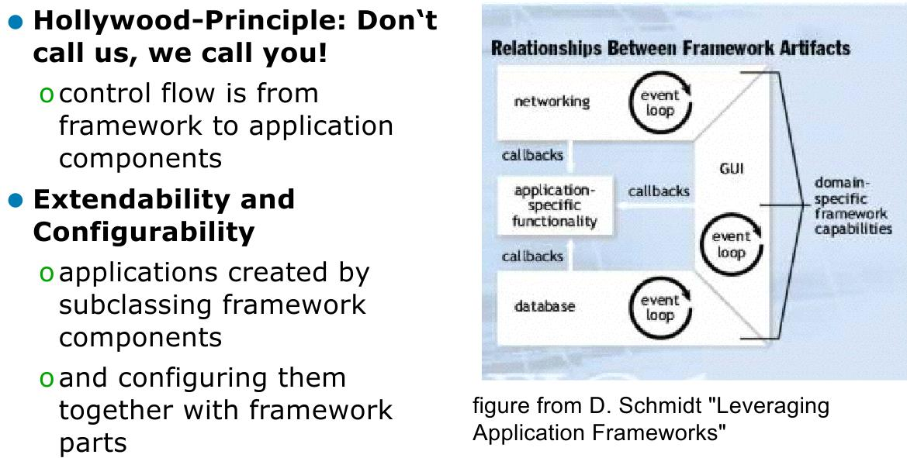

* Entwickler hat weniger Aufwand bei der Nutzung eines Frameworks, da er nur ein Delta und nicht die ganze App entwickeln muss
* FW besiten Hooks (Erweiterungspunkte)

Micro Framework
---------------

Viele Design Patterns zeigen Micro Frameworks, da sie Erweiterungsmöglichkeiten bieten:

* Template Method
* Strategy
* Command Processor
* Decorator

Template Method
...............

.. image:: img/4.4.jpg

Strategy
........

.. image:: img/4.5.jpg

Kombiniert man Strategy mit NullObject, so kann man ein Default Verhalten implementieren für den Fall, das der Benutzer keine Strategy anlegt.

Command Processor
.................

.. image:: img/4.6.jpg

5 Values
========

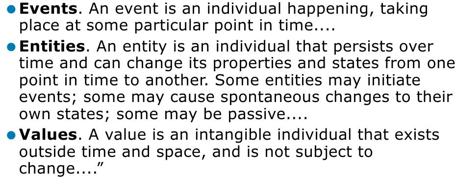

   Michael Jackson System Analysis: Unterscheidung von Individuals. Individual bleibt das gleiche, aber sein Verhalten kann sich ändern.

* Values Verändern sich nicht (42 sieht immer glech aus, schreibt sich immer gleich und ist immer gleich viel wert), besitzen einen Wert.

Beispiele
---------

* Events
	* Geburt
	* Klick
	* Welcome Bar
* Entities
	* Person
	* Artikel
	* 
* Values
	* 42
	* Datum
	* Range

Objektkategorisierung
---------------------

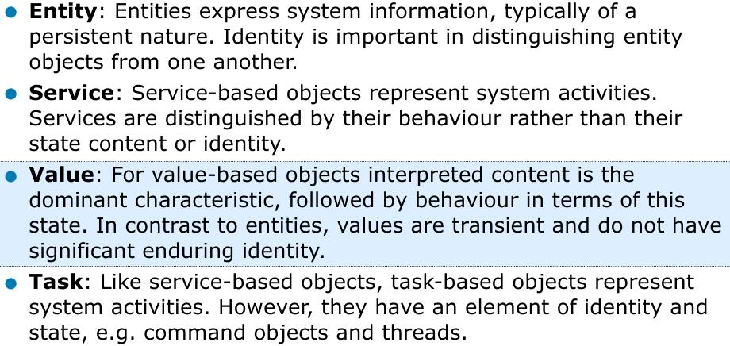

* Entity: Identität, Individualität im Vordergrund
	* Student
	* File
* Service
	* File Writer
	* Stundenplan eintragen
	* LokalisierungsAPI Google Maps
	* Badgelader
* Value: Identität irelevant, besitzen meist keine, unveränderbar
	* Integer
	* String
* Task: Beispiel Kreditantragsformular (Auftrag an Sachbearbeiter)
	* Badgeauftrag (über Nacht)
	* Bestellung (Wenn Fokus auf Ablauf, sonst Entity)

Werte
-----

* Werte ändern sich nicht -> keine Seiteneffekte
* Exemplare eines Typs, Typ definiert Verhalten
* Typen können Dimensionen definieren, wie km oder kg
* Funktionen mappen Argumente auf einen Ausgangsvalue

Objekt Charakteristik
---------------------

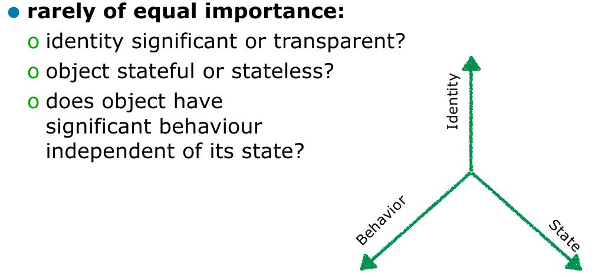

* State: Attribute/Member
* Behaviour: Methoden
* Identität: Referenz auf Objekt

Value Objects
-------------

* Kommen eigentlich nie in UML Diagramm vor, weil die Identität irelevant ist
* z.B. String

.. note:: Soll eine ISBN Nummer ein eigener Datentyp sein oder String? Wenn interner Aufbau unwichtg: String, wenn Aufbau, Validation und Korrektheit wichtig: ISBN-Type

* In OO Sprachen muss dafür gesorgt werden, dass bei Werttypen
	* Equality den Wert und nicht die Identität vergleicht "hallo".equals("world")
	* Die Identität keine Rolle spielt
	* Es darf keine Rolle spielen, ob der Wert kopiert oder per Referenz übergeben wird
	* Wertklassen haben weder Parent noch Children (meist)
		* nicht "virtual" oder "final"
* Identität spielt keine Rolle -> Persistenz ist einfach
* Über das Netzwerk können nur Werte geschickt werden! Objektversand ist nur eine Emulation

.

.. image:: img/5.4.jpg

Whole Value Pattern
...................

* Nicht nur primitiver Typ, sondern Kapselung als zusammengesetztes Element
* Man sagt auch noch, was der Wert bedeutet: 
	* z.B: Was es ist + Masseinheit wird noch dazugespeichert
	* Bsp: 100: 100 + Km + Distanz -> Distance Klasse
	* Bsp: 11:  11 + Monat + November -> Month Klasse
* -> Unterschiedliche Daten lassen sich nicht zusammenrechnen (z.B. Distanzen mit Zeit) -> **Security**

.. code-block:: java

	public final class Date {
	public Date(int year, int month, int day)
		...
	}
	
	Date right = new Date(year, month, day);
	
	// Problem: lässt sich verkehr herum aufrufen
	Date wrong = new Date(day, month, year);
	Date alsoWrong = new Date(month, day, year);

* Erschaffung eines Types zur Verhinderung, das Zeug zusammengerechnet wird, das man nicht solte (Datum + Distanz)

.. code-block:: java

	public final class Year {
		public static Year valueOf(int year) {return new Year(year);}
		public Year(int year) { value=year;}
		public int getValue() { return value;}
		private final int value;
	}

	public final class Date {
		public Date(Year year, Month month, int day)
			...
		}
	}
	
	... new Date(Year.valueOf(year), Month.valueOf(month),	day);

Value Object
------------

* Sprachen ohne Values: Objekt bauen, das Values speichert
* Identität ist irrelevant -> Vergleichsoperatoren müssen Value vergleichen
	* Java
		* **equals()**
		* **hashCode()**
		* ev. Serializable implementieren
		* ev. Hilft toString bei komplexem Value (equals nutzt in dem Fall toString -> nicht sooo effizient)
	* C++
		* == und != Operator überladen

.. note:: Prüfungsfrage: Vervollständigen Sie die Klassendefinition des Value Object. -> equals und hashCode implementieren.

Class Factory Method
--------------------

* Erzeugung von Hole Value meisst umständlich.
	.. code-block:: java
	
		Date clumsy = new Date(new Year(year), new Month(month), day);

	
* -> Methode bereitstellen, die das ganze komplett initialisiert:
	.. code-block:: java
	
		Date clumsy = Date.createDate(25,12,2014);

Copied Value
------------

* pass modifiable Objects into methods
* Cloneable Interface implementieren -> Kopierkonstruktor implementieren
	* prevents sharing. preserves encapsulation
* Immutable Value verwenden -> Nur bei Objekten, die häufig abgefragt werden
	* C++
		* Bsp: Stringmember zurückgeben, der nicht kopiert und nicht verändert werden kann: Konstref
			.. code-block:: c++
			
				std::string const & getText() const {
					return text;
				}

Cloning
-------

* Liefert Kopie, egal was es für ein Typ ist
* Factory Methode
* **!= Prototype!** aber Cloning wird gebraucht für Prototype

Prototype
---------

* Nutzt Objektinstanz/Kopie als Defaultwert für neue Objekte
* Für Objekte mit komplexer interner Konfiguration
* z.B. Für CommandObjekte, CMS Content Elements

Copy Constructor
----------------

* Kann Probleme mit Unterklassen ergeben, wenn es anstelle Parentobjekt verwendet wird -> Slicing: Was die Unterklasse zusätzlich implementiert wird abgeschnitten

Immutable Value
---------------

* Sharing Probleme -> Objekt muss unveränderlich sein
* Implementation des Copykonstruktor kann vergessen gehen -> sharing Probleme
* Automatisch Thread Save
* z.B. Keys in Hash Map sollten nicht verändert werden
* -> Alle Fields sind final
	* Verhindern, das Unterklassen Felder wieder nicht final machen können (final class)
* C++: 
	* Constref oder ConstObjekt oder einzelne Constmember
	* Alle Memeberfunktion const

Mutable Companion
-----------------

* z.B. Nicht veränderbare Strings
* temporäre Objekte

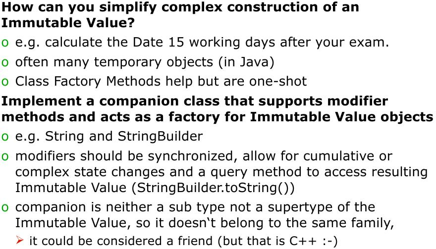

.. note:: Prüfung: Java Code lesen und schreiben können

.. note:: Kevlin Henney: http://www.curbralan.com lesen, kommt an Prüfung

6 Reflection
============

* Zur Laufzeit Code nachladen, hinzufügen, ergänzen -> Informationen über Objekte müssen vorliegen
	* Neuer Code muss eine Beschreibung seiner selbst mitbringen
* Testing Frameworks sind auf Reflection angewiesen
* Annotations

Warum Reflection?
-----------------

* Austauschen von Softwareteilen ist schwierig.
* Komponenten verwenden, die man noch nicht kennt
* zur Laufzeit
* Verteilte Systeme: Was läuft auf dem Andern System? Was hat es für Schnittstellen?
* Compiler weiss viel mehr über die Software als die Software über sich selbst. Compiletimereflection -> Runtimereflection
* Algorithmen können nicht wiederverwendet werden, weil sie nicht vollständig generalisiert werden können

.

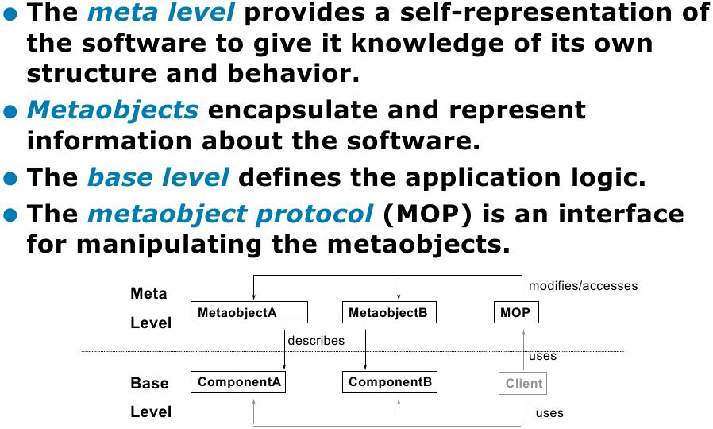

.. important:: Meta Layer bescheibt, wie Base Layer funktioniert und aufgebaut ist.

* Introspection: Was für Klassen gibts, Fields abfragen, Methoden, ...
* Intercession: Meta Layer verändern -> Bei Compilergenerierter Reflection nicht möglich
	* z.B. Klassen zur Laufzeit neue Attribute geben
	* Verhalten hinzufügen / ersetzen
* Bsp State
	.. image:: img/6.2.jpg
	   :width: 50 %

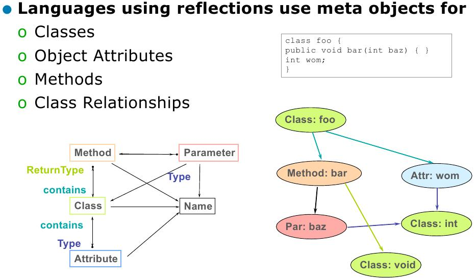
   
   Meta Object

Sprachfeatures, die von Reflection abhängig sind
------------------------------------------------

* Dynamische Polymorphie
	* vTables C++
	* Dynamic loading and invocation
		* Remote Method invocation, Marshalling, Serialisierung
	* Dynamic Casts
	* RDBMS Select From Tables Table
	* Meta Classes Java / Small Talk
	* Componentware
	

Where would one use reflective mechanisms?
------------------------------------------

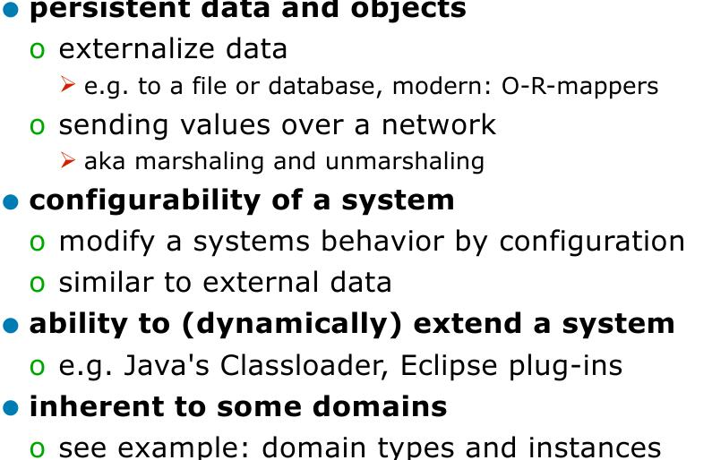

Type Object Design Pattern
--------------------------

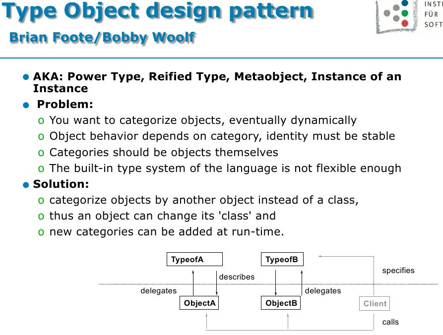

Bsp: Buchausleih: Buch ist Meta Information, Buchausleihe ist das Buch, das mit einem Benutzer verbunden ist

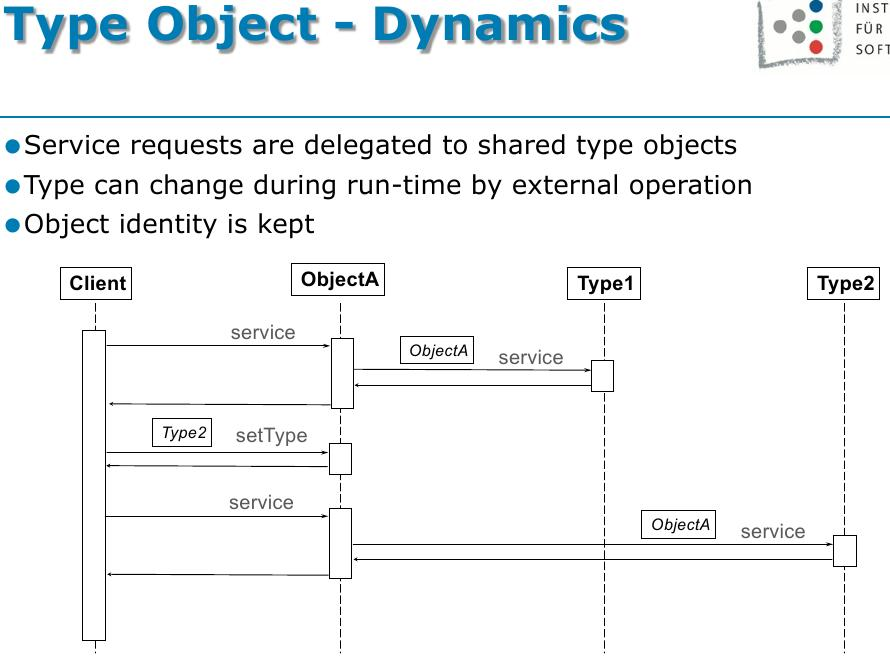

.. note:: Meta Layer beschreibt das Verhalten, Baselayer ist das Objekt selbst

.. note:: MOP: Meta Object Protocol (Interface um die Metadaten abfragen/verändern zu können)

Limitationen
............

* Tiefere Effizienz durch Indirections
	* z.B. Vtables in C++ bei Polymorphismus
	* In Java dyn. Polymorphie abschalten: final class

Beispiel
........

* Buchverleih:
	* Bücher sind Type Objects
	* Exemplare sind Base-level Objects

Property List
-------------

.. image:: img/6.7.jpg

Vorteile
........

* Flexible Attribute für Objekte in Form von Key-/Value
* Dynamisch erweiterbar ohne Programmänderungen
* Objekte können verändern werden ohne die Identität zu verlieren
* Organsiation der Properties ist dem Entwickler überlassen (Tree, Hashmap, ...)
* Universelle Abfrage über Properties unabhängig vom Objekttyp

Nachteile
.........

* Konfusion: Normale Attribute und Attribute in Property List auf Objekt (Zersplitterung des Objektes)
* Property List sind Strings -> keys sind nur konvention und Property format nicht zwingend
* Nur die Clients wissen, was die Properties bedeuten (Objekt selbst weis nichts über Properties, insbesondere deren Verhalten)
* Schlechte Struktur der Properties: Aufwand zum Suchen
* Flache Struktur

Anything
--------

* ähnlich wie PropertyList
* Erlaubt substrukturen wie z.B. das ablegen von Adresse
	* -> Values dürfen wiederum Property List sein
	* -> Values dürfen auch Sequenzen (Listen sein)
	* Anything kann gleich viel wie JSON

Einsatzgebiet
.............

* In typisierten Sprachen, wo feste Datentypen gefordert wären, kann mit Anything Flexibilität eingebracht werden
* Konfigurationsmechanismen
* Informationen über Schnittstellen (Compile-unabhängig)
* Iterieren über die Struktur ist einfach

.. code-block:: c

	{ # array with 2 elements
		{ # 1st array element; a /Name "Smith"
			/Address {
				/Country "USA"
				/City "Palo Alto"
				/State "CA"
			}

		}
		{ # 2nd array element 
			/Name
			/...
		}
	}

 
.. code-block:: xml

	<array> <!-- array with 2 elements -->
		<record> <!-- 1st array element; a record-->
			<element><key>Name</key><value>"Smith"</value></element>
			<element><key>Address</key><value>
			<record>
				<element><key>Country</key><value>"USA"</value></element>
				<element><key>City</key><value>"Palo Alto"</value></element>
				<element><key>State</key><value>"CA"</value></element>
			</record>
		</record>
		<record><!-- 2nd array element -->
			<element><key>Name</key>
			...
			...
		</record>
	</array>

Implementation
..............

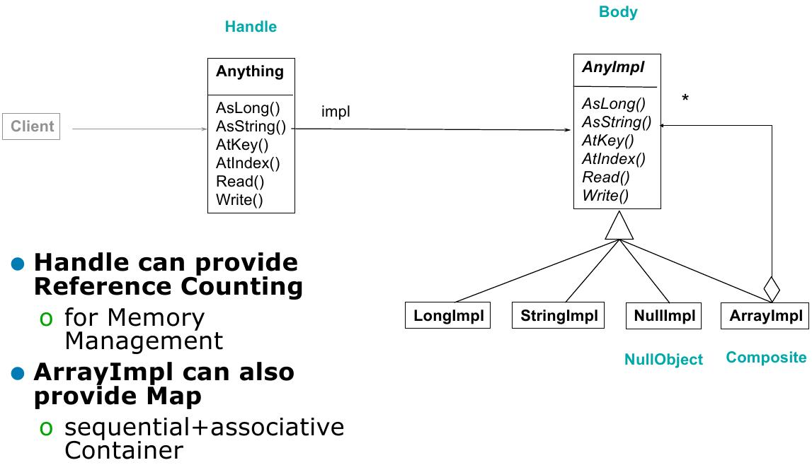

Nachteile
.........

* Keine Compilerprüfung
* Overhead für Zugriff
* Keine Information darüber, ob ein Element noch benutz wird (Dangling Elements)

Extension Interface
-------------------

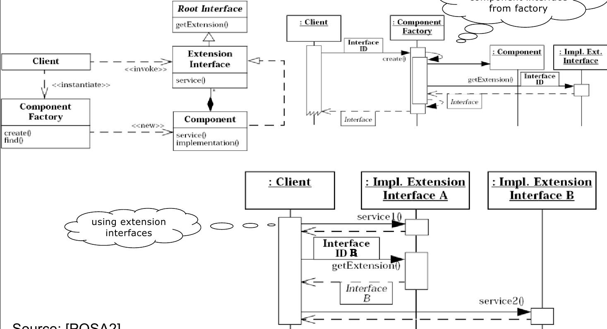

* Basisinterface liefert Schnittstellen
	* Aus der Komponente wird das Extensioninterface abgeholt und an den Client ausgeliefert

Vorteile
........

* Komponente kann um Interfaces erweitert werden, ohne das die KLassenhirarchie angepasst werden muss
* Es müssen nicht alle Schnittstellen in ein Interface gepackt werden
* Interfaces können zusammengesteckt werden
* Klassen benötigen kein generelles gemeinsames Interface

Nachteile
.........

* Benutzung ist komplexer
* Laufzeitoverhead / mehr Indirektion
* Der originalen Komponente wird nicht angesehen, was sie alles kann (konnte), da die Kommunikation nur über die Interfaces läuft

Reflection Feedback
-------------------

* Potential für "Overdose Effect"
* Teuer in Rechenleistung
* Speicherverbrauch
* Gefahr der Überflexibilisierung
* Gefahr von Zu stark konfigurierbare Strukturen
* Gefahr von Untergraben von Funktionalität

7 Frameworkers Dilemma
======================

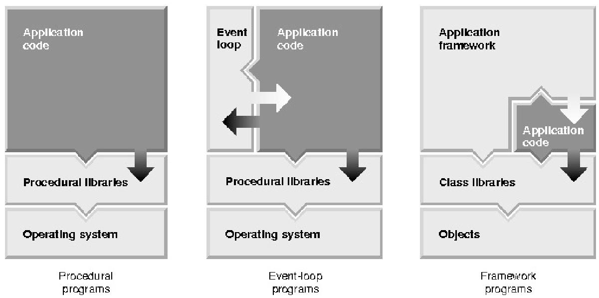

* Frameworks: Hollywood principle (don't call us, we call you)
* Code der Applikation ist stark an Framework gekoppelt (Vererbung / Implementation)
* Wird das Framework geändert -> Application Code läuft nicht mehr

Vorteile
--------

* Weniger Applicationcode / Einfacherer Code
* Mehr Wiederverwendung
* Modularer Code / Robuster Code
* Einfachere Wartung
* Produktfamilien

Nachteile
---------

* Code eines Frameworks lässt sich kaum zu einem andern portieren
* Hohe Kopplung
* Bindung an Hersteller und Plattform
* Tests umständlich
* Lösungen
	* Entkopplungslayer -> Overhead
	* Eigenes Framework bauen ;-)
* Werden nur Teile des Frameworks gebraucht, muss man trotzdem das ganze nutzen/importieren

Intra Framework
---------------

* Coupling und lock-in innerhalb des Frameworks
* Framework intern zu hoch gekoppelt
* Framework ist wie ein grosser Klumpen
* Frameworks lassen sich intern schlecht testen

Framework lock-in
-----------------

* Anforderungen ändern sich / Fehler im Framework
	* Framework entwickelt sich kaum weiter
		* niemand nutzt es (keine Weiterentwicklung)
		* all enutzen es -> Schnittstellen können nicht geändert werden
	* Dilemma

	
Ways out of Dilemma
-------------------

* Vor dem Framework-Bau nachdenken
	* Problem: Nachher ist man schlauer
	* Flexibilität kann zu Unbeutzbarkeit führen
	* Dauert ewig
* Schnittstellen-Nutzer ignorieren und Schnittstellen dauern anpassen
	* Nur wenn Nutzer an Anbieter gebunden sind
	* Neue Version führt zu Portierung
	* User laufen möglicherweise weg
* Sozialen Prozess mit Anpassung und Feedback
	* Depracted Interfaces -> Overhead
	* Alten Code weiter mitpflegen
	* Commite, das über Changes entscheidet -> Politik
	* Schulung notwendig

	
Technische Lösungen
...................

* Schlichte einfache Interfaces -> stabiler
* Flexible Interfaces -> stabiler
* Konfigurierbarkeit
* Einsatz von Patterns
* TDD -> Sofort Opfer der Design Entscheidungen werden
	* Tests komplizier -> Benutzung kompliziert
* Generische Parameter für Hook Methoden

Dynamische Parameter / Kontext Objekt
.....................................

* Problem: Of gelöst über Member -> Globale Variablen in der Klasse
* Parameter typen sind sehr generisch -> Alles kann mitgegeben werden
* -> Besser: Kontext Objekt, das alles mitbringt was es dazu braucht

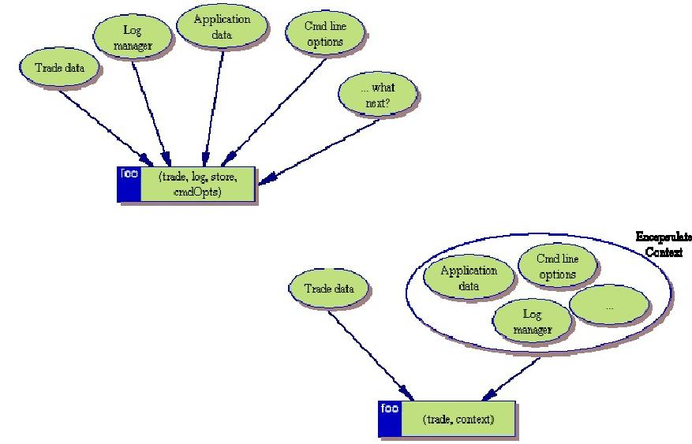

* Schnittstelle wird mit Kontextobjekt viel weniger breit -> besser lesbar, dynamischer

.. note:: PropertyList als Parameter -> dynamische Parameterübergabe typenunabhängig

Flexible Plugins
................

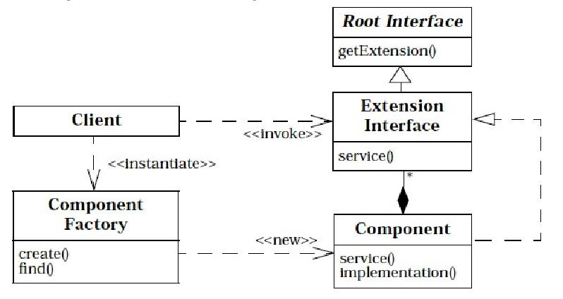

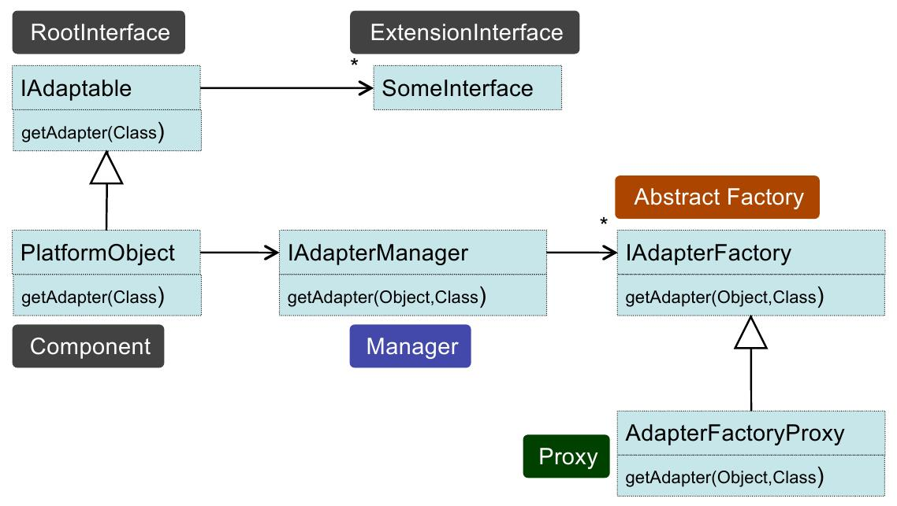

   IAdaptable Extension Interface von Eclipse

8 WAM
=====

Flexibilität einbringen in App
------------------------------

* Konfigurierbare App
	* Komponenten (Plugins)
	* Zusammenspiel
* Scripting (
	* Vorsicht mit selbst gebauten Sprachen
	* Besser existierende Scriptsprachen verwenden!
	

Metaphern
---------

* Software sollte NIE den Meschen steuern -> unangenehm (Fabrik Metapher)
* WAM Metapher: Experten Arbeitsplatz

Leitbild
--------

.. figure:: img/8.1.jpg

   Leitbild WAM

* Werkzeug (Tool)
	* -> Womit bearbeitet wird (aktiv)
	* Materialien bearbeiten / anschauen
	* wiederkehrende Tätigkeiten
	* verschiedene Aufgaben
	* wird benutzt und wieder zur Seite gelegt
* Material
	* -> Was bearbeitet wird (passiv)
	* virtuelle Gegenstände
* Arbeitsumgebung
	* z.B. Eclipse Workspace
	* Beinhaltet gesammten Arbeitskontext: Wo habe ich zuletzt gearbeitet? welche Files? Welche Ansichten?
	* Individuell
	* Vor Fremdzugriff geschützt
	* Ein-Benutzer System: Arbeitsplatz = Arbeitsumgebung
* Automat
	* Routinearbeiten
	* benutzt Materialien, liefert definiertes Resultat
	* oft im Hintergrund
	* Beschränkt menschliche Eingriffe
	* Automaten werden konfiguriert, ev. gescriptet und dann gestartet.
* Container
	* beinhaltet, verwaltet, ordnet und liefert Materialien
	* gleichartige oder definierte menge unterschiedlicher Objekte
	* repräsentieren oft einen Arbeitsablauf, sammeln zugehörige Objekte
* Fachwerte (Values)

Patterns
--------

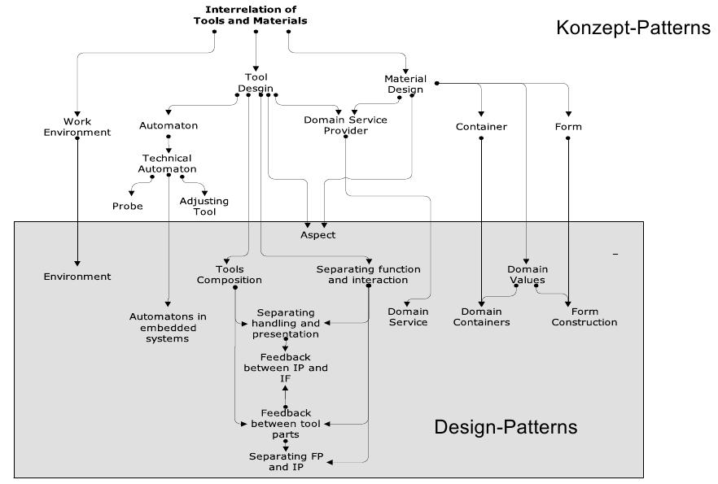

   WAM Patterns

Werkzeuge
---------

Trade-offs
..........

* sollten nicht zu gross werden -> überfordern / Kohäsion
* sollte Arbeitsprozess nicht unnötig vorgeben oder reinschränken
* Jede Teilfunktionalität eines Werkzeugs sollte jederzeit benutzbar sein

Design Charakteristiken
.......................

* Werkzeug besitzt Identität, Gedächnis, Namen, Graphische Repräsentation

Arbeitsumgebung
---------------

* Vernünftige Default Werte

.. note:: Arbeitsplatz (Workspace) ist Teil der Arbeitsumgebung (Work Environment)

Formulare
---------

* konzeptionell eigenständig
* stellen spezielle Materialien dar
* sollten konfigurierbar sein
* Alle Formulare verhalten sich gleichartig

Domain Service Provider
-----------------------

* neueres Konzept, wird in WAM eingebettet
* Zentrale Sammlung von Arbeitsobjekten sind KEINE DSP!
* Reine Funktionsbibliotheken sind KEINE DSP!
* DSP beinhaltet Domänenwissen
* Komplexe Zusammenhänge / Objektstrukturen, Geschäftstransaktionen
* Materialsammlungen mit Domänenbezug

Technische Automaten
--------------------

* Technischer Automat: Steuerung von Geräten
	* Sonden: Zustandsabfrage für techn. Automat
		* -> Gerätezustand wird zum Arbeitsplatz transportiert
	* Einstellungswerkzeuge für Wartung & Steuerung

Implementation
--------------

Werkzeug- / Materialkopplung (Aspect)
.....................................

* WZ und Mat müssen zusammenpassen
* WZ soll ev. für mehrere Materialien eingesetzt werden
* Jede Nutzung eines Materials stellt einen Aspekt dar
* Aspekte sind Schnittstellen des Materials, die das Werkzeug implementiert

.. note:: **SOLID**: Single Responsibility Principle , Open/Closed, Liskov Substitution Principle, Interface Aggregation Principle, Dependency Inversion Principle

* Extension Interface Pattern ermöglicht das Werkzeug später zu erweitern
* Werkzeug wird gegen ein- oder mehrere Interfaces programmiert
* Matrialien können gleiche wie verschiedene Interfaces anbieten
* -> Werkzeug fügt sich den Schnittstellen, die das Material zur Verfügung stellt
* Nicht zu viele Interfaces am Anfang erstellen -> Abspalten von Interfaces ist später einfach (Rafactoring)

.

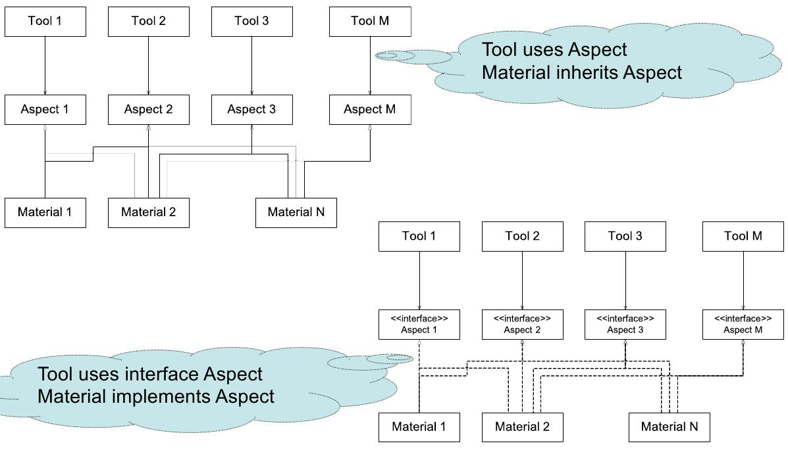

   Aspekte über Vererbung

* Vererbung ermöglicht, im generischen Aspekt schon Logik zu implementieren / vorzugeben. Interfaces bieten diese Möglichkeit nicht.
* Problem Vererbung: Viele Sprachen bieten keine Mehrfachvererbung

.

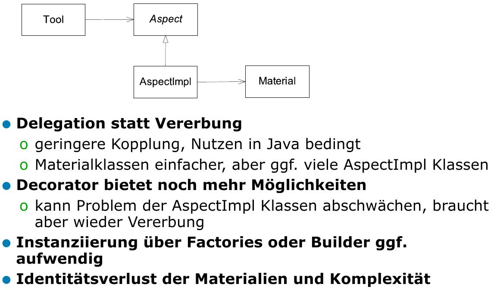
   
   Aspekte über Adapter oder Decorator (Delegation, unten rechts, da das Material die Impl. delegiert statt davon zu erben) -> Adapter Pattern ersetzt Vererbung

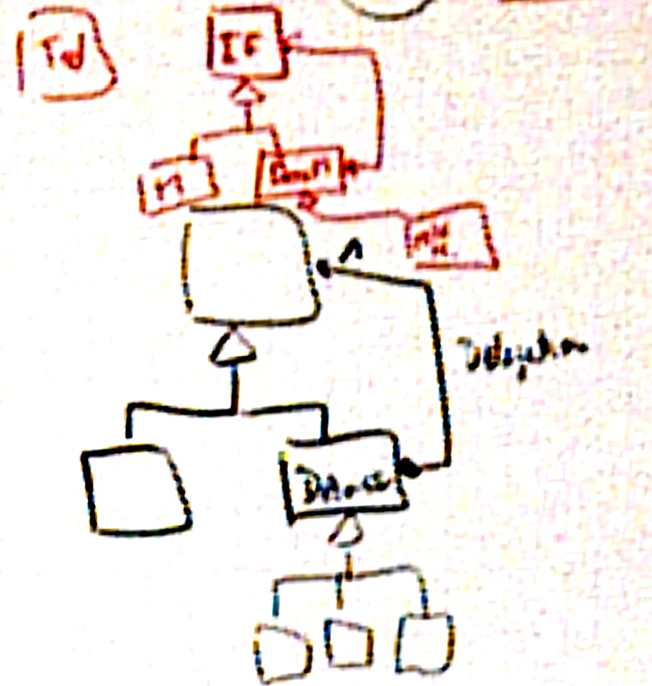

   Decorator Example (Flipchart), Schwarz: Decorator grundprinzip, Rot: Decorator mit Interface (IF), Material (M), Materialdekoration (DecM)
   

* Problem Decorator: Aufrufendes Objekt sieht eingewickeltes Objekt nicht

.. note:: Unterschied Adapter/Decorator: Adapter verändert Schnittstelle exitierender Objekte, Decorator erweitert Verhalten gleichartiger Objekte

.. warning:: Decorator und Adpater kommen in Prüfung

Trennung von Funktion und Interaktion
.....................................

* Funktion lässt sich unabhängig vom UI testen
* MVC / MVVM / MV*
* UI Model, das das UI für die Ausgabe benutzt
* Separat testbar
* Wenn nur wenig Logik vorhanden ist, ist es nicht sinnvoll ein Viewmodel etc. zu erstellen -> Trennen sobald App wächst

Werkzeuge
.........

* Werkzeuge zusammensetzen aus Teilfunktionalität
* Composite Pattern oder Whole Part Pattern

.

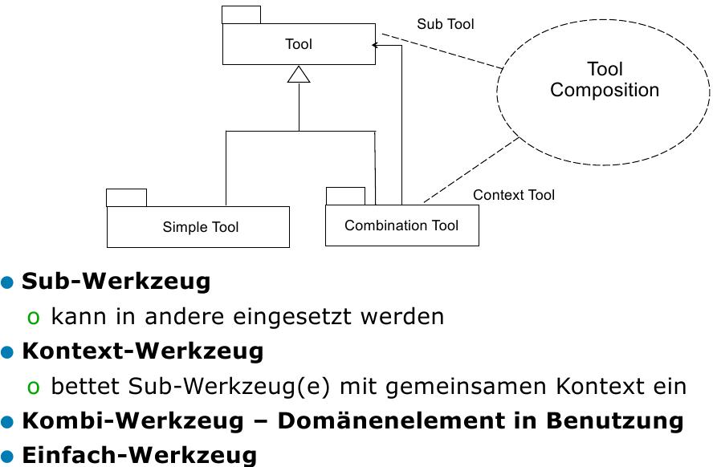
   
   Werkzeugkomposition

.. note:: Steht im Diagramm bei der Beziehung eine 1, so ist es Decorator, steht ein stern, so ist es Composite

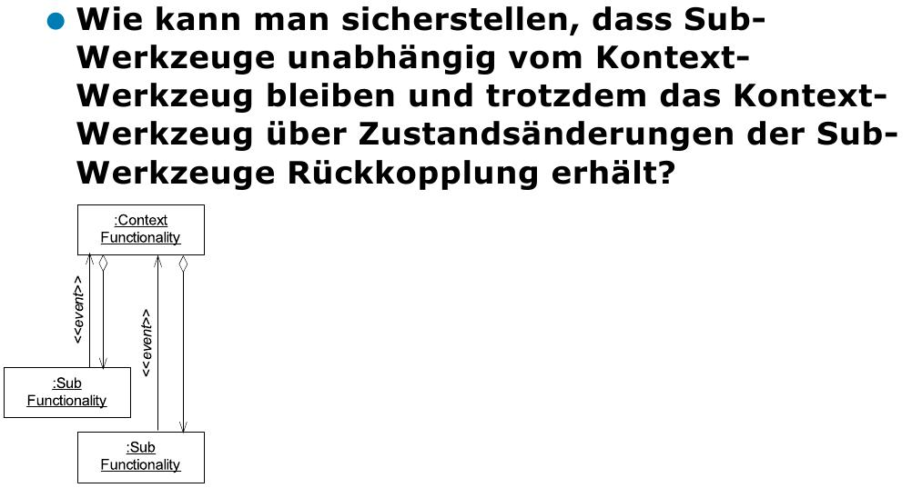
   
   Feedback (Observer)
   
   
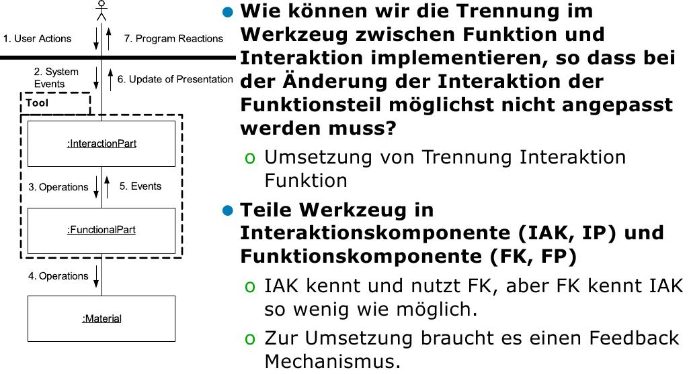
   
   Rückkopplung zwischen Funktion und Interaktion

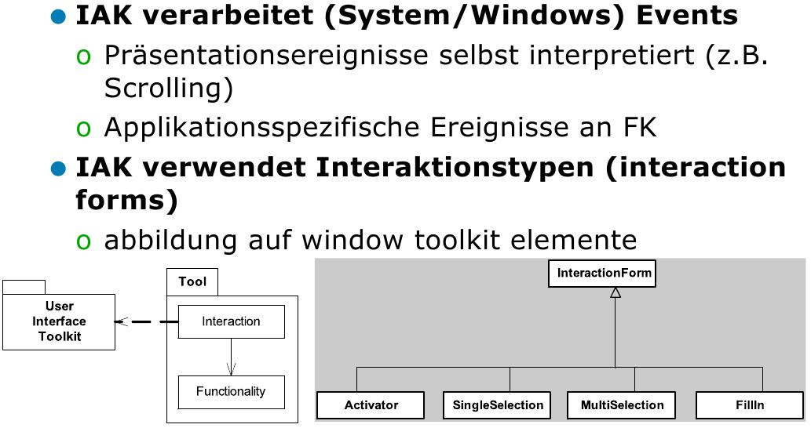
   
   Feedback FK-IAK

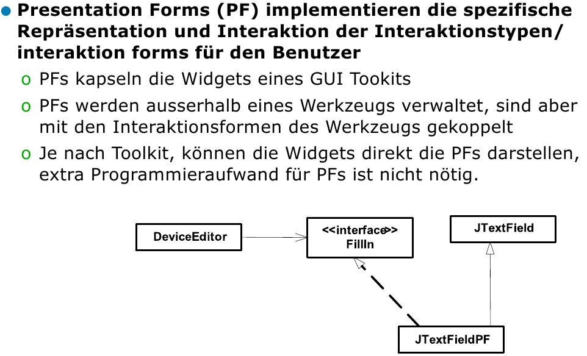
   
   Trennung von Handhabung und Repräsentation

Fachliche Behälter
..................

* Oft mehr als nur ein Vektor oder ein Set
* Resourcen laden: lazy loading / eager loading
* Werkzeuge können auch direkt auf Behältern Funktionen ausführen

Formulare
.........

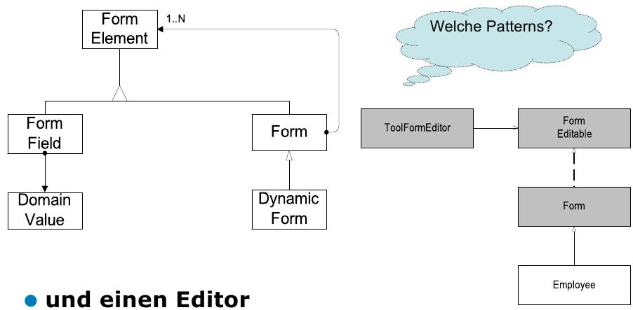

   Formularsystem (Composite Pattern da * Beziehung)

* Nicht übertreiben -> Interaktion von Formularsystem ist begrenzt
* Kann Materialkonzept untergraben

Automaten in Embedded Systems
.............................

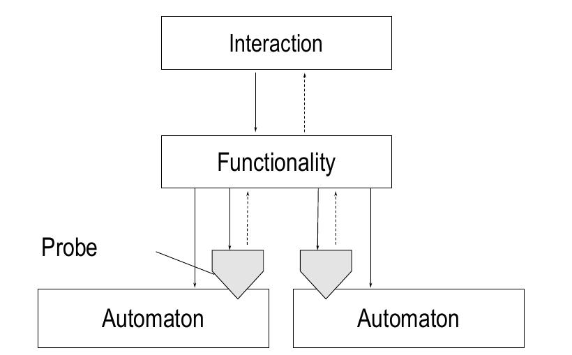

   Entkoppelung: Asynchrone Anbindung

* Alternative: Broker einsatz

Domain Services
...............

* Übers Netz werden nur Werte, keine Objekte übertragen
* -> Wertorientierte Schnittstellen
* Kapselt Material und Implementierung
* Braucht ev. Session Konzepte, Authorisierung, Rollen
* Multiuser konzepte

WAM Service Architektur
.......................

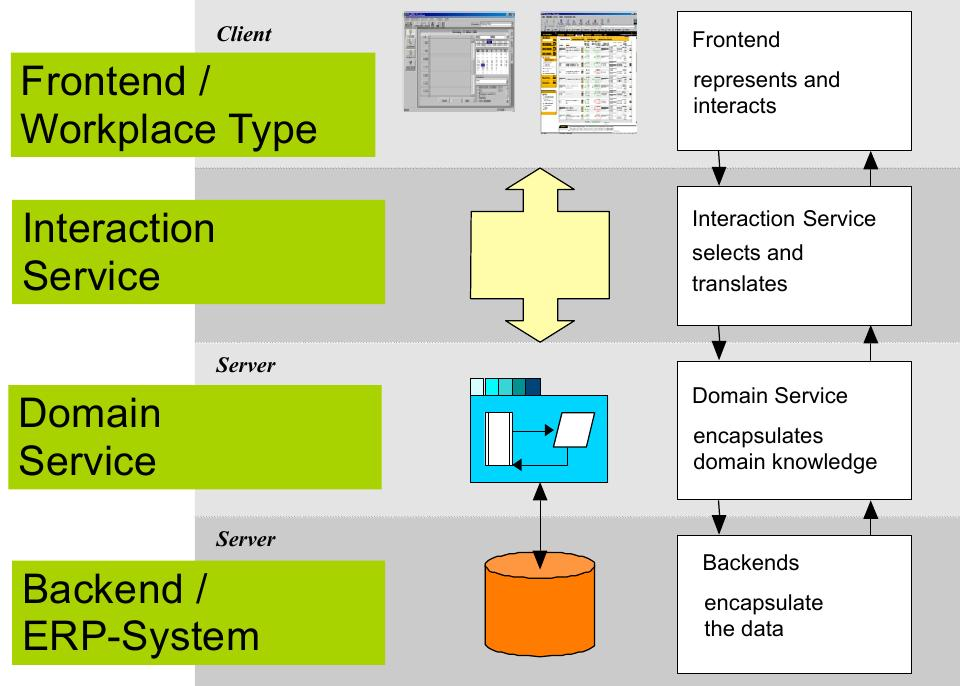

   Dargestellt: eigentlich Tiers, keine Layers

Environment (Arbeitsumgebung)
.............................

* Eine einzige Klasse
* Beinhaltet Workspace Konzept
	* Vorgaben für Materialien und Werkzeuge
	* Schablonen

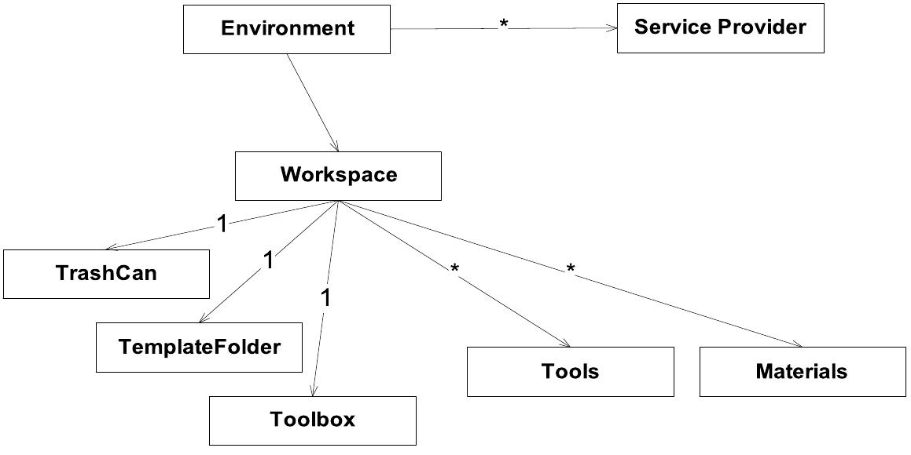

9 Unit Testing Frameworks
=========================

.. warning:: An der Prüfung Factory Methoden erkennen können. z.B. createTestResult(), ...

10 Parallel Programmning
========================

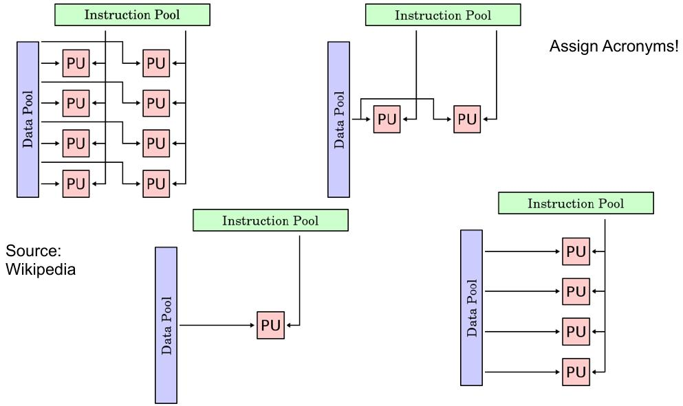

* Single Instruction Single Data SISD: unten links (nicht parallel)
* Single Instruction Multiple Data SIMD: unten rechts (GPU , Vektor-Instruktionen
* Multiple Instruction Single Data MISD: oben rechts (selten)
* Multiple Instruction Multiple Data MIMD: oben links (Core i)

.

figure:: img/10.2.jpg

Task Decomposition
------------------

* Zerlegen der Aufgabe in Häppchen, die parallel ausgeführt werden können.
* Taskzerlegung: Nur Aufgaben, die unabhängig sind können parallel ausgeführt werden.
* Zerlegung benötigt mehr Rechenzeit, wird durch parallelisierung wieder eingespart
* Viele Schleifendurchläufe mit vielen Daten: Sind die Durchläufe unabhängig, so können diese Häppchenweise parallelisiert werden

Data decomposition
------------------

* Daten aufteilen, z.B. Bildhälften sepparat berechnen
* Bäume / Grafen sind schwierig zu parallelisieren
* z.B. Matrixmultiplikation, Wetter Vorhersage, Multimedia processing

.

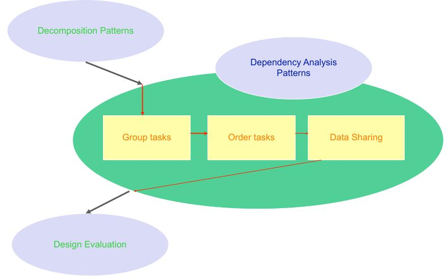

Data Sharing
------------

* Daten aufteilen in read-only, local to one task, read-write
* vermeiden von race conditions, synchronisation, kommunikationsoverhead

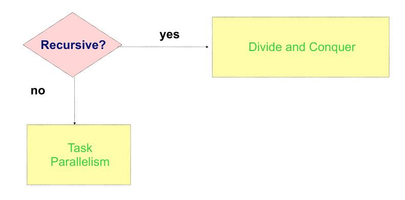

   Organized by tasks?

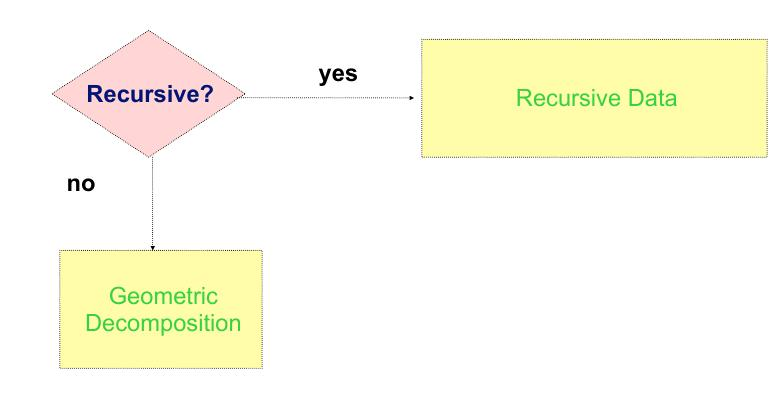

   Organized by data?

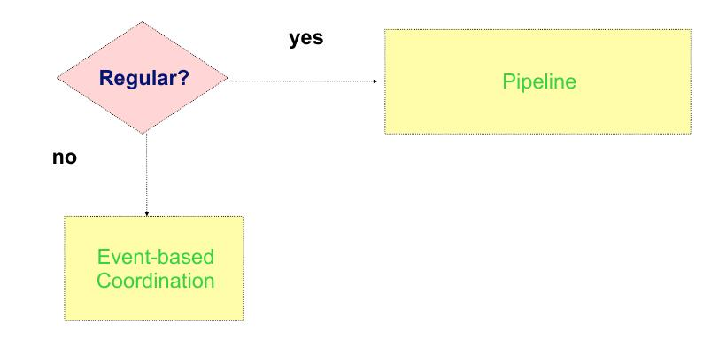

   Oragnized by ordering?
   

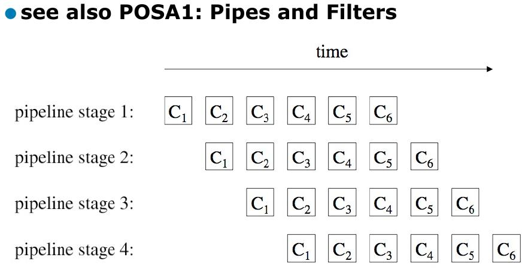

   Pipelining

   
   
11 Flyweight & Singleton
========================

Flyweight
---------

* Hoher Speicherverbrauch weil viele Objekte
* Zustand eines Objektes befindet sich ausserhalb
* -> Ermöglicht wenige shared Objekte
* Intrinsic State: Das, was bei den Objekten variieren kann

.. note:: Objekt: Wird definiert durch Identität, State und Verhalten

* Objektidentität spielt keine Rolle: Value Object
* Objektidentiät und State spielen keine Rolle: Library

.. note:: Unshared Concrete Flyweight: Objekte ausserhalb des Patterns (normale Objekte), 
   die das Flyweightpatter implementieren

   
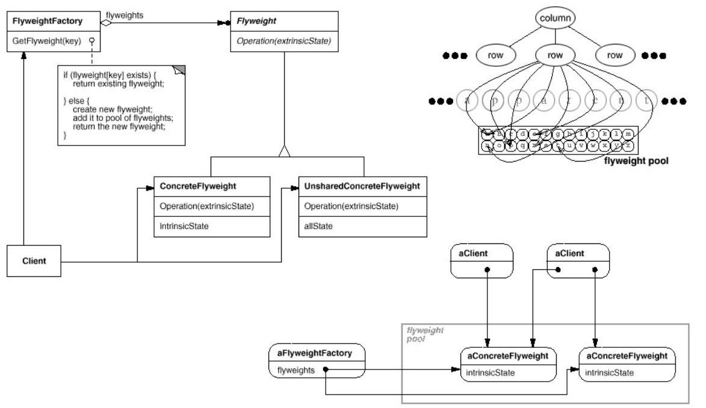

Flyweight Konsequenzen
......................

* Extrahieren des State spart Speicherplatz
* Speicherplatzeinsparung Systemanhängig
* Mehr Sharing -> Mehr Speicherplatzeinsparung

Overweight or Underweight?
..........................

* Sharing Objekte müssen read only sein
* Flyweight beinhaltet Immutalbe Value, Factory Method und Pooling

.. note:: Immutable Value: State wird bei Erzeugung gesetzt, wenn das Objekt geändert wird, wird
   das Objekt kopiert (Java: String).
   
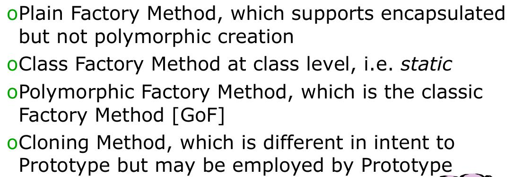

   Arten von Factories

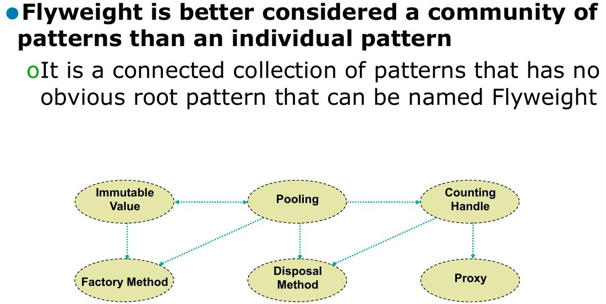

   Flyweight Reconstructed

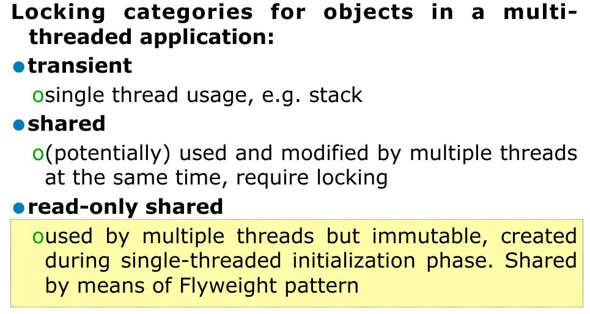

   Locking Categories

Singleton
---------

* Hauptproblem: Globaler Zugriff

Lösungen
........

* Komponente der Klasse mitgeben, die mir die benötigte Komponente zurückgeben kann

.. note:: Monostate: Singleton, dessen State als static attributes abgelegt ist und jede Instanz diese verwendet. 
   Methoden greifen auf static Attribute zu. Ist transarent, Singleton kann ohne getInstance() verwendet werden, 
   sieht aus wie ein normales Objekt.

CRTP
....

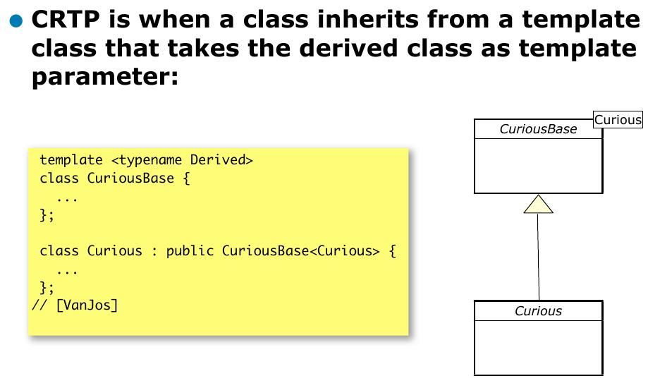

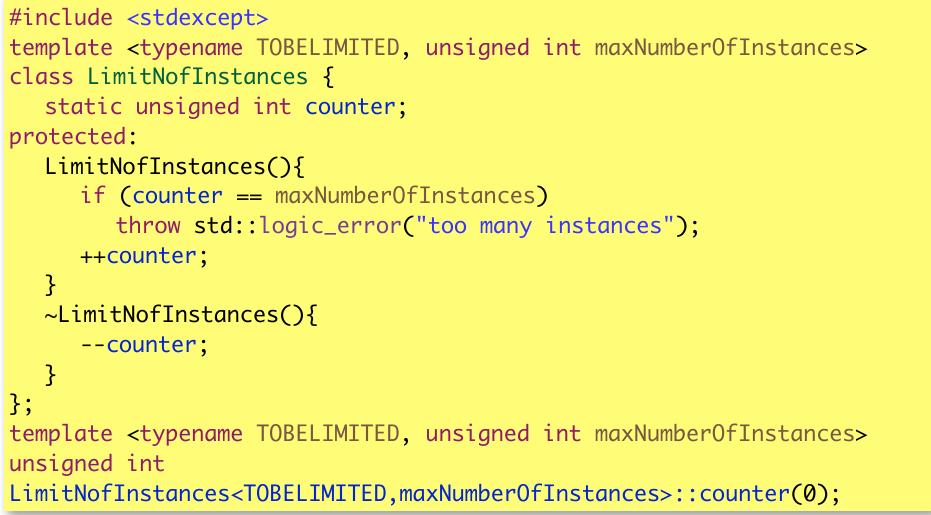

CRTP limitiert die Anzah existierender Instanzen, löst jedoch die Probleme vom Singleton 
(beim Destructor werden Instanzen wieder freigegeben).

Refactored Singleton
....................

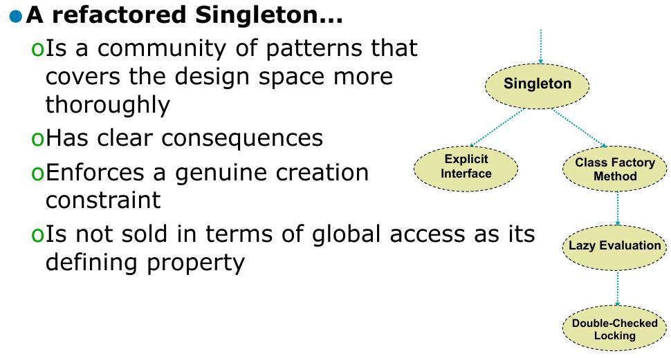

   Singleton erbt alle Nachteile der andern Patterns

