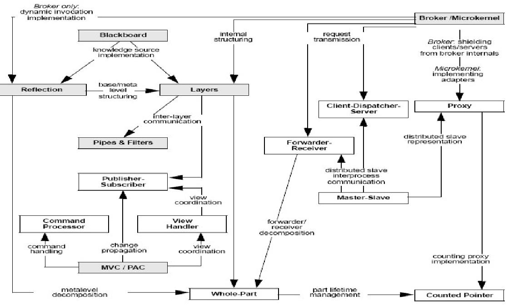

================
FS14 Summary APF
================

0 Allgemeine Infos
==================

* Prüfung: Openbook

1 Patterns
==========

* Verhaltens/Designmuster, Engineeringstories (mehrfach erfolgreiche)
* Was sich bewährt hat und reproduzierbar ist
* Patterns werden nicht erfunden (höchstend entdeckt) sondern im Rahmen einer Erfindung angewendet!
* Namen der Klassen bei Patterns bezeichnen Rollen, keine konkreten Klassennamen
* Patterns sind praktische Tools aber keine Allerweltsheilmittel und nicht für Anfänger geeignet
* **Definition** Patterns sind das Medium um das How-To Wissen zu kommunizieren
* Patterns können Freiheitsgrade enthalten (bewusste Variantenentscheidung)
* Patterns können Beziehung zu andern Patterns enthalten

1.1 Zusammensetzung Pattern
---------------------------

* Wie's gemacht wird
* Beschreibung
	* Name (Ermöglicht das Reden darüber, man weiss was gemeint ist)
	* Problem
	* Einflussfaktoren, die das Problem schwierig machen
	* Probleme, die immer wieder auftreten
	* Lösung (Forces)
	* Vor- und Nachteile (Trade-of's -> Konsequenzen) -> Lohnt es sich überhaut für einen konkreten Fall das Pattern anzuwenden?
	
	
1.1.1 Gute Patternbeschreibung
------------------------------

* Gute Patterns diskutieren auch deren Nachteile
* Gute Patterns beschreiben eine wiederholbar mehrfach erfolgreiche Vorgehensweise
	

1.2 Abgrenzung
--------------

* Allgemeine Vorgehensweisen wie KIS, SOLID oder DRY sind keine Patterns!
* Dinge, die nur einmal funktionieren / funktioniert haben
* Algorithmen, Prozesse, Kochrezepte, ... sind keine Patterns.
* Lösungen ohne Probleme
* Probleme ohne Lösungen
* Patterns sind keine fertigen Lösungen
	

1.3 Pattern Übersicht
---------------------

1.4 Pattern Beziehungen
-----------------------

a) Refinement: Pattern basiert auf Implementation eines Anderen
b) Variation: Pattern zeigt Alternative oder Variante eines andern Patterns
c) Spezialisierung: Pattern ist spezielle Variante eines generischen
d) Setting Context: Pattern ist Voraussetzung für Anderes

