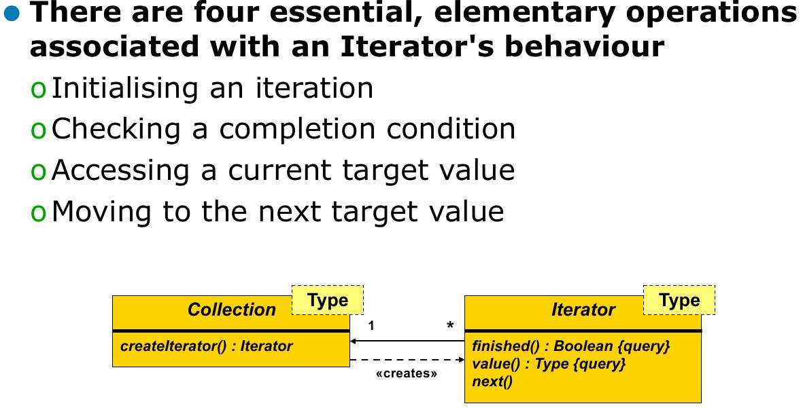
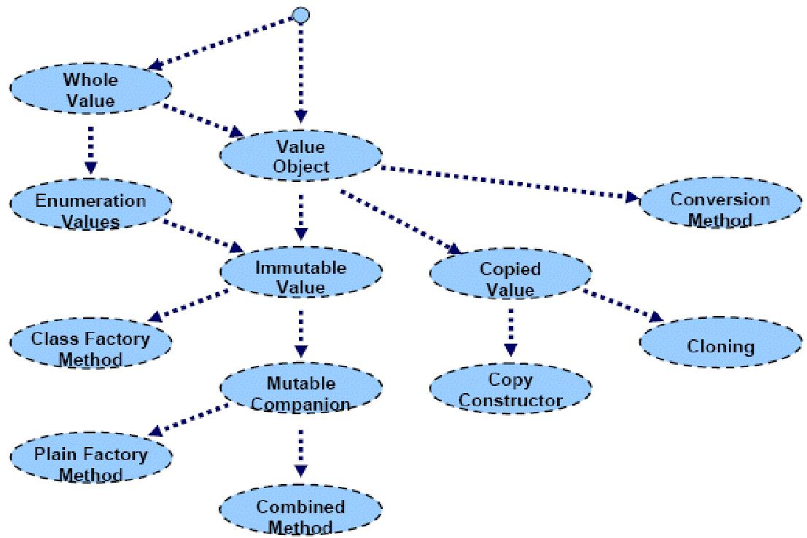

================
FS14 Summary APF
================

0 Allgemeine Infos
==================

* Prüfung: Openbook

1 Patterns
==========

* Verhaltens/Designmuster, Engineeringstories (mehrfach erfolgreiche)
* Was sich bewährt hat und reproduzierbar ist
* Patterns werden nicht erfunden (höchstend entdeckt) sondern im Rahmen einer Erfindung angewendet!
* Namen der Klassen bei Patterns bezeichnen Rollen, keine konkreten Klassennamen
* Patterns sind praktische Tools aber keine Allerweltsheilmittel und nicht für Anfänger geeignet
* **Definition** Patterns sind das Medium um das How-To Wissen zu kommunizieren
* Patterns können Freiheitsgrade enthalten (bewusste Variantenentscheidung)
* Patterns können Beziehung zu andern Patterns enthalten

1.1 Zusammensetzung Pattern
---------------------------

* Wie's gemacht wird
* Beschreibung
	* Name (Ermöglicht das Reden darüber, man weiss was gemeint ist)
	* Problem
	* Einflussfaktoren, die das Problem schwierig machen
	* Probleme, die immer wieder auftreten
	* Lösung (Forces)
	* Vor- und Nachteile (Trade-of's -> Konsequenzen) -> Lohnt es sich überhaut für einen konkreten Fall das Pattern anzuwenden?
	
	
1.1.1 Gute Patternbeschreibung
------------------------------

* Gute Patterns diskutieren auch deren Nachteile
* Gute Patterns beschreiben eine wiederholbar mehrfach erfolgreiche Vorgehensweise
	

1.2 Abgrenzung
--------------

* Allgemeine Vorgehensweisen wie KIS, SOLID oder DRY sind keine Patterns!
* Dinge, die nur einmal funktionieren / funktioniert haben
* Algorithmen, Prozesse, Kochrezepte, ... sind keine Patterns.
* Lösungen ohne Probleme
* Probleme ohne Lösungen
* Patterns sind keine fertigen Lösungen
	

1.3 Pattern Übersicht
---------------------

1.4 Pattern Beziehungen
-----------------------

a) Refinement: Pattern basiert auf Implementation eines Anderen
b) Variation: Pattern zeigt Alternative oder Variante eines andern Patterns
c) Spezialisierung: Pattern ist spezielle Variante eines generischen
d) Setting Context: Pattern ist Voraussetzung für Anderes

2 GoF Patterns
==============

2.1 Flyweight
-------------

* Vermeiden von mehrfachem Vorkommen von gleichartigen Objekten, die sich nie ändern. -> Platz sparen.
* Viele Objekte beschäftigen den GC.
* Heap wird von allen Threads gemeinsam genutzt

   Flyweight Pattern (Einfach)
   
   
* Flyweightmanager gibt bei der Anforderung z.B. eines A (Char Object) nicht ein neues sondern ein bestehendes.
* Das Sharing funktioniert nur, wenn die Objekte konstant sind (sich nicht verändern) (intrinsicState)
	* C++: member const machen
	* Java: fields final machen
* Client ruft nie selbst "new" auf sondern geht immer über den Manager

   Flyweight extended.
   
   
* UnsharedConcreteFlyweight werden nicht im Pool abgelegt sondern ganz normal verwendet
* Vorteile: Anzahl Objekte werden reduziert
* Nachteil: 
	* Objekte können nicht mehr anhand der Referenz unterschieden werden.
	* Flyweightmanager wird benötigt
* Praxisanwendungen: AWT

2.2 Memento
-----------

* Speichern des internen Zustandes eines Objektes zur späteren verwendung.
* Wie kann dieser interne Zustand verwendet werden ohne die Kapselung zu verletzen?
* Undo, Versionsverwaltungen

   Memento Pattern. Saubere Kapselung wird erreicht duch stärkere Kopplung zwischen Memento und Originator.

* Alternativen: Objekt klonen, Reflection, Changes protokollieren.
* Schmalspur-Memento: Erinnerungsinformation reicht nicht aus um das Objekt zurückzusetzen, jedoch um zu erkennen, das es sich geändert hat (Bsp. Java Collection Iterator Change detection).
* Vorteile: Kapselung bleibt erhalten
* Nachteile:
	* Zustand kann ncith direkt inspiziert werden
	* Vollständige Kopie, keine Diffs
	* Speicherverbrauch

2.3 Mediator
------------

* Vermittler
* Wenn's zuviele gibt, die einander benachrichtigen wollen
* Kommunikation unter Objekten ohne das diese sich gegenseitig kennen müssen
* Observer ist eine Implementationsform des Mediators

   Mediator

* Mediator kennt alle Kommunikationspartner, Partner kennen sich jedoch nicht untereinander
* Bei Implementation des Mediators muss man aufpassen, das er nicht zu viele Abhängigkeiten besitzt.
* Vorteile: 
	* Einzelne Teilnehmer sind einfach austauschbar (Kopplung reduziert)
	* Einzelne Partner müssen sich nicht direkt kennen.
	* Mediator leistet Korrdination (Priorisierung, Filterung)
	* Zentrale Kontrolle
* Nachteile:
	* Soll die Kontrolle verändert werden, muss der Mediator umgebaut werden
	* Fällt der Mediator aus, ist die Kommunikation down

2.4 Visitor
-----------

Composite Pattern:

::

	      .-----.
	      | op()| *
	      |_____|<--------.
	       ^   ^          |
	      /     \         |
	.-----.     .-----.   |
	| op()|     |op() |<>-'
	|_____|     |_____|

* Kindelemente können anstelle parent verwendet werden -> Parent führt Liste mit Childs und rift auf diesen eine Funktion auf.
* Erweiterung von Funktionalität ist aufwendig beim Composite -> daher Visitor

.. note:: Visitor: Kapsle eine auf den Elementen einer Objektstruktur auszuführende Operation als ein Objekt. Das Besuchermuster ermöglicht es Ihnen, eine neue Operation zu definieren, ohne die Klasse der von ihr bearbeiteten Elemente zu ändern

   Visitor Pattern
   
   
* Visitor lohnt sich nur, wenn sich die Knotentypen kaum ändern.
* Anwendungsfall: Compilerbau

2.5 Command
-----------

	

* Kapselung einer Funktion als Objekt
* Ojekt wird jemand anderem mitgegeben statt direkt ausgeführt
* Vorteile: 
	* Command Objekte lassen sich speichern und wiederverwenden
	* Objekt kann an mehreren Stellen verwendet werden
	* Neue Commands lassen sich einfach hinzuzufügen zur App
	* Commands können aufgezeichnet und wieder abgespielt werden -> makro, undo
	
------------

.. figure:: img/2.7.jpg
   :width: 75%

   Command Processor

   

2.6 Patterns, die zusammen vorkommen können
===========================================

* Visitor und Composite
* Flyweight und Composite
* Memento und Command

.. warning:: Mögliche Prüfungsfrage

3 Beyond GoF Patterns
=====================

3.1 Iterator
============

* Über Elemente iterieren können ohne deren internen Aufbau zu kennens
* Iterator muss sehr eng gekoppelt sein mit dem zu iterierenden Objekt, dafür ist Kopplung zum Iterierenden schwach

.. warning:: An Prüfung Code als Iterator erkennen können.

* Robuste Iteration (wenn sich Collection verändert hat) ist schwierig umzusetzen
* Iteratorobjekt ist entkoppelt und kriegt möglicherweise nicht mit, wenn sich Collection ändert (c++ -> undefined behaviour)

3.2 Enumeration Method
======================

* Teil des Iterator Pattern
* z.B. .each()
* An die aufrufende Methode wird ein Command Objekt weitergegeben, das die Iteration übernimmt.
* Keine Kopplung vom Command Objekt zur Collection

3.3 Batch Method
================

* Wenn Collection auf Server und Iterator auf CLient -> Problem mit Latenz bei jeder Iteration
* -> Collection wird in Häppchen übertragen und während lokal iteriert wird bereits das nächste Häppchen nachgeladen

3.4 State
=========

3.4.1 Objects for States (GoF)
------------------------------

* Ein Objekt kann sein Verhalten ändern, in dem ein Teil des Verhaltens ausgelagert wird in ein referenziertes Objekt, das ausgetauscht werden kann.
* Unterschied zu Strategy: Beim State Pattern wechselt die States automatisch, beim Strategy muss man die Strategy wählen

   

* Klassen, die von der State ableiten (a,b,c) besitzen keine eigenen Daten (stateless)

2.4.2 Methods for States (Tabellen)
-----------------------------------

* Alternativen: States lassen sich auch mit Statetables umsetzen
	* Bsp: Compiler setzt Switch als Sprungtabelle um

* Vorteil: Methoden, die nichts machen können einfach als Null-Object abgelegt werden

2.4.3 Collections for States
----------------------------

* Objekte werden zu Häufchen zugeordnet und darüber entscheidet sich deren Verhalten.
* -> Zugehörigkeit eintscheidet Verhalten

.. important:: Selbstlesestoff zu State

4 Frameworks
============

* OO Klassen, die zusammen arbeiten
* Erweiterungspunkte
* FW ist meisst halbfertig -> Erweiterungspunkte
* Unterschied zu Bibliothek: Framework ruft meinen Code auf, nicht ich rufe die Bibliothek auf
	* -> Inversion of Control
* Framework ist Programmskelett

.

   Framework mit vorgelagerter Config und selbst impleentierter main Funktion

.. warning:: Unterschied Lib / FW und Eigenschaften FW kommt an der Prüfung

* Entwickler hat weniger Aufwand bei der Nutzung eines Frameworks, da er nur ein Delta und nicht die ganze App entwickeln muss
* FW besiten Hooks (Erweiterungspunkte)

Micro Framework
---------------

Viele Design Patterns zeigen Micro Frameworks, da sie Erweiterungsmöglichkeiten bieten:

* Template Method
* Strategy
* Command Processor
* Decorator

Template Method
...............

.. image:: img/4.4.jpg

Strategy
........

.. image:: img/4.5.jpg

Kombiniert man Strategy mit NullObject, so kann man ein Default Verhalten implementieren für den Fall, das der Benutzer keine Strategy anlegt.

Command Processor
.................

.. image:: img/4.6.jpg

5 Values
========

   Michael Jackson System Analysis: Unterscheidung von Individuals. Individual bleibt das gleiche, aber sein Verhalten kann sich ändern.

* Values Verändern sich nicht (42 sieht immer glech aus, schreibt sich immer gleich und ist immer gleich viel wert), besitzen einen Wert.

Beispiele
---------

* Events
	* Geburt
	* Klick
	* Welcome Bar
* Entities
	* Person
	* Artikel
	* 
* Values
	* 42
	* Datum
	* Range

Objektkategorisierung
---------------------

* Entity: Identität, Individualität im Vordergrund
	* Student
	* File
* Service
	* File Writer
	* Stundenplan eintragen
	* LokalisierungsAPI Google Maps
	* Badgelader
* Value: Identität irelevant, besitzen meist keine, unveränderbar
	* Integer
	* String
* Task: Beispiel Kreditantragsformular (Auftrag an Sachbearbeiter)
	* Badgeauftrag (über Nacht)
	* Bestellung (Wenn Fokus auf Ablauf, sonst Entity)

Werte
-----

* Werte ändern sich nicht -> keine Seiteneffekte
* Exemplare eines Typs, Typ definiert Verhalten
* Typen können Dimensionen definieren, wie km oder kg
* Funktionen mappen Argumente auf einen Ausgangsvalue

Objekt Charakteristik
---------------------

* State: Attribute/Member
* Behaviour: Methoden
* Identität: Referenz auf Objekt

Value Objects
-------------

* Kommen eigentlich nie in UML Diagramm vor, weil die Identität irelevant ist
* z.B. String

.. note:: Soll eine ISBN Nummer ein eigener Datentyp sein oder String? Wenn interner Aufbau unwichtg: String, wenn Aufbau, Validation und Korrektheit wichtig: ISBN-Type

* In OO Sprachen muss dafür gesorgt werden, dass bei Werttypen
	* Equality den Wert und nicht die Identität vergleicht "hallo".equals("world")
	* Die Identität keine Rolle spielt
	* Es darf keine Rolle spielen, ob der Wert kopiert oder per Referenz übergeben wird
	* Wertklassen haben weder Parent noch Children (meist)
		* nicht "virtual" oder "final"
* Identität spielt keine Rolle -> Persistenz ist einfach
* Über das Netzwerk können nur Werte geschickt werden! Objektversand ist nur eine Emulation

.

Whole Value Pattern
...................

* Nicht nur primitiver Typ, sondern Kapselung als zusammengesetztes Element

.. code-block:: java

	public final class Date {
	public Date(int year, int month, int day)
		...
	}
	
	Date right = new Date(year, month, day);
	
	// Problem: lässt sich verkehr herum aufrufen
	Date wrong = new Date(day, month, year);
	Date alsoWrong = new Date(month, day, year);

* Erschaffung eines Types zur Verhinderung, das Zeug zusammengerechnet wird, das man nicht solte (Datum + Distanz)

.. code-block:: java

	public final class Year {
		public static Year valueOf(int year) {return new Year(year);}
		public Year(int year) { value=year;}
		public int getValue() { return value;}
		private final int value;
	}

	public final class Date {
		public Date(Year year, Month month, int day)
			...
		}
	}
	
	... new Date(Year.valueOf(year), Month.valueOf(month),	day);

