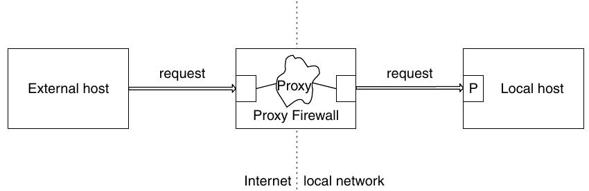
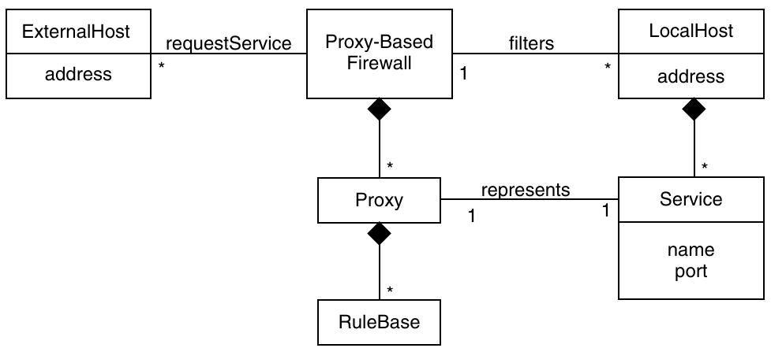
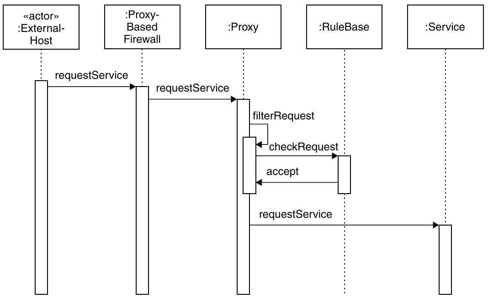

=========================
12.2 Proxy based firewall
=========================

Eine "Proxy basierte Firewall" inspiziiert und filtert ein- und ausgehenden Netzwerkverkehr anhand des Application Service Typs der aufgerufen wird.

Context
=======

Systeme eines lokalen Netzwerks, die mit dem Internet verbunden sind und Paket Filter für die Sicherheit nicht ausreichen.

Problem
=======

Paketfiler Firewalls filtern nur anhand der Adresse. Filterung nach aufgerufenem Application Service Typ ermöglicht dediziertere Filterung.

* Das Netzwerk ist nicht isoliert
* Die Firewall muss auf verschiedene Attacken vorbereitet sein
* Der Administrator möchte ein klares Model, nach dem die Filterung funktioniert
* Die Filterregeln sollen die Policies der Organisation wiederspiegeln
* Die Filterregeln sollen einfach anpassbar sein
* Regest sllen gelogt werden können.

Solution
========

Dem Application Service wird ein Proxy vorgeschaltet. Der Client kommuniziert nur mit dem Proxy. Der Proxy leitet nur erlaubte Anfragen an den Service weiter.

Die Proxies beinhalten eine RuleBase, die Regeln zusammenfasst. Application Service Zugriffe müssen durch die Regeln erlaubt sein, ansonsten wird der Request abgebrochen.

Alle Clients im lokalen Netzwerk teilen sich die Firewall. Jeder Client kann mehrere Services anbieten.

Die Firewall filtert den Request anhand der Application Proxies und deren Zugriffsregeln. Passt keine Regel zum Request, so wird eine Default Regel angewendet. Wird der Request zugelassen, so ist der Client erlaubt durch den Proxy hindurch den Service zu nutzen. Andernfalls wird der Request abgebrochen.

Implementation
==============

1) Definieren, welche Services für Clients verfügbar sind
2) Für jeden Service einen Proxy entwickeln oder einkaufen
3) Zugriffsrestriktionen definieren
4) Restriktionen als Regeln umsetzen
5) Configuration ausarbeiten

Closure
=======

✔ Requests werden basierend auf vordefinierte Application proxies gefiltert

✔ Implementationsdetails des lokalen Hosts wird durch den Proxy verborgen

✔ Sämmtlicher Verkehr fliesst durch die Firewall, dadurch kann er einfach gelogt werden.

✔ Mehr Sicherheit als bei einem Paketfilter

✗ Implementationskosten für spezielle Proxies

✗ Performance Overhead

✗ Erhöhung der Komplexität der Firewall

✗ Für jeden Service wird ein Proxy benötigt

Verwandte und benutzte Patterns
===============================

* Benutzte Patterns:
	* Proxy
* Kann kombiniert werden mit:
	* Packet Filter Firewall
	* Stateful Firewall

Prüfungsfragen
==============

a) Proxy Based Firewall filtert den Datenverkehr anhand einer Paketanalyse nach Daten, die Injection verursachen könnten.

b) Der Datenerkehr fliesst durch die Firewall, dadurch wird der Verkehr leichtverzögert, kann aber einfach gelogt werden.

c) Proxy Based Firewall besitzt für jeden erlaubten Service ein Proxy Interface. Der Client interagiert nur mit dem Proxy. Nur erlaubte Aufrufe werden an den Servie weitergeleitet.

Antworten zu den Fragen
=======================

a) falsch. Begründung siehe c.

b) richtig

c) richtig