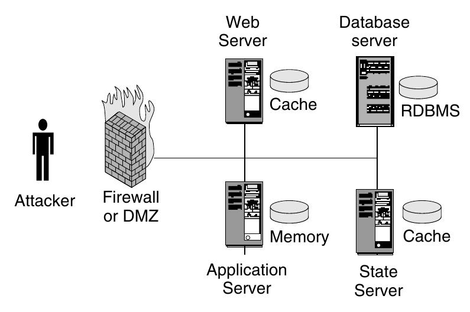
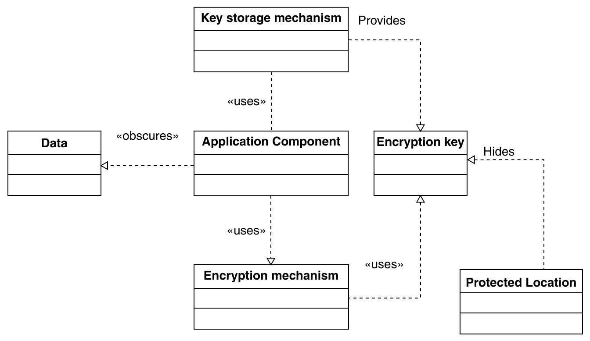

==========================
13.1 Information Obscurity
==========================

Sensitive Daten in einem System müssen geschützt werden. Dies kann durch Verschlüsselung und durch Verschleierung von Informationen über die Umgebung geschehen.

Context
=======

Umgebungen mit Application Server und Persistence Storage, die hinter einer Demilitarisierten Zone im internen Netz stehen und schützenswerte Daten verarbeiten.

   Beispiel einer Umgebung

Problem
=======

* Sensitive Daten, die verarbeitet und gespeichert werden, müssen geschützt werden
* Nicht sensitive Daten sollen nicht geschützt werden
* Daten müssen trotz Schutz zugreifbar sein
* Ver- und Entschlüsselung verlangsamen das System
* Verschlüsselungsschlüssel müssen ebenfalls geschützt werden

Solution
========

1.) Daten nach ihrer Sensitivität bewerten
2.) Sensitive Daten durch Verschlüsselung schützen
3.) Massnahmen ergreifen zum Schutz von Verschlüsselungskeys etc.

Structure
---------

   
   Information Obscurity Structure

Die "Application Component" benutzt "Verschlüsselungsmechanismen" um sensitive Daten in Teilen des Systems zu verschlüsseln.
Die "Encrypetion Keys" müssen zwingend an einem sicheren Ort untergebracht werden.

Implementation
--------------

* Daten im System **kategorisieren** (sensitiv/nicht sensitiv). Dabei müssen verschiedene Aspekte betrachtet werden:
	* Vertrauliche Daten müssen vor unauthorisiertem Drittzugriff geschützt werden, z.B. Patientenakten
	* Vertrauliche Daten sollten nicht Auffindbar / Indexierbar sein, z.B. Kreditkarteninformationen
	* Der Ort, an dem die Daten gespeichert werden sollte nicht zugreifbar sein, z.B. Cache Disk
	* Bestimmte Daten müssen besonders geschützt werden, da sie zur Kompromitierung von weiteren Daten verwendet werden können, z.B. Verschlüsselungskeys
	* Datenschutzregeln / Gesetzliche Vorgaben
* **Sicherheitsaudits** zum Zeitpunkt des Systemaufbaus und bei jeder Veränderung an der Architektur durchführen, um die Berücksichtigung aller Aspekte auch im Betrieb zu gewährleisten
* **Storage** und Speichrerart auswählen. Für kurze verschlüsselte Daten können gewöhnliche Textfelder verwendet werden, für grössere Datenmengen ist BLOB besser geeignet
* Verschlüsselung nur dort umsetzen, **wo es wirklich nötig ist**. Eine Möglichkeit, die Verschlüsselung zu reduzieren, ist die Anzahl "Mauern" zu erhöhen, durch die ein Cracker einbrechen muss, um an die Daten zu kommen.
* **Transportwege** müssen ebenfalls geschützt werden. Zwischen den Komponenten des Systems bewegen sich die Daten möglicherweise über ein Netzwerk.
* System- und Verschlüsselungs**konfiguration** schützen.
* Sensitive Daten sollten nach Möglichkeit auf Systeme verschoben werden, die **nur intern zugreifbar** sind.
* Security By Obscurity Massnahmen: (Vorsicht !)
	* Keys in Konfigurationsfiles nicht sprechend benennen, damit Angreifer es schwerer haben, den Key zu finden
	* Konfiguration / Keys in Binaries einkompilieren
* Systeme so auslegen, das trotz Verschlüsselung die nötige **Performance** erbracht werden kann. Dies erhöht unter Umständen die Betriebskosten des Systems
* Sicherheit der **Infrastruktur** erhöhen, z.B. Randomisierung von Host Namen

Closure
=======

✔ Mehr Sicherheit im System

✔ Sensitive Daten sind für Attacker nicht benutzbar / zugreifbar

✔ Die Performance wird so wenig wie möglich beeinträchtigt

✔ Die Sicherheit der Systemkonfiguration wird erhöht

✗ Die Systemperformance wird beeinträchtigt

✗ Die Wartbarkeit wird beeinträchtigt, insbesondere durch das randomisieren von Host Namen oder Konfigurationsbezeichnungen

✗ Es wird zusätzlich Key Management und die Wartung der Verschlüsselungskonfiguration benötigt

✗ Die Entwicklungskosten sind höher, da Verschlüsselung in viele Komponenten eingebaut werden muss

✗ Die laufenden Kosten des Systems sind höher

Verwandte und verwendete Patterns
=================================

* In der Umgebung möglicherweise Verwendete
	* Common Persistence Storage
	* DMZ
	* Protection Reverse Proxy
	* Integration Reverse Proxy
* Verwendete
	* Security Needs Information For Enterprise Assets
* Häufig kombinierte
	* Secure Channels

Prüfungsfragen
==============

a) Überall wo möglich soll Verschlüsselung und Verfremdung eingesetzt werden, um auch beim Design unbeachtete Sicherheitsaspekte abzudecken
b) Die Daten im System sollten klassifiziert werden, um die Daten der Business Kunden stärker schützen zu können als Daten von Privatanwendern.
c) Daten, die andere Daten kompromitieren können, müssen besonders geschützt werden. Dazu gehören unter Anderem Passwörter und Source Code.

Antworten zu den Fragen
=======================

a) Falsch. Es soll so viel wie nötig aber so wenig wie möglich Verschlüsselung und Verfremdung eingesetzt werden, um die Beeinträchtigung des Systems so klein wie möglich zu halten.
b) Richtig, Falsch
c) Falsch. Andere Daten kompromitieren können z.B. Encrypten Keys
