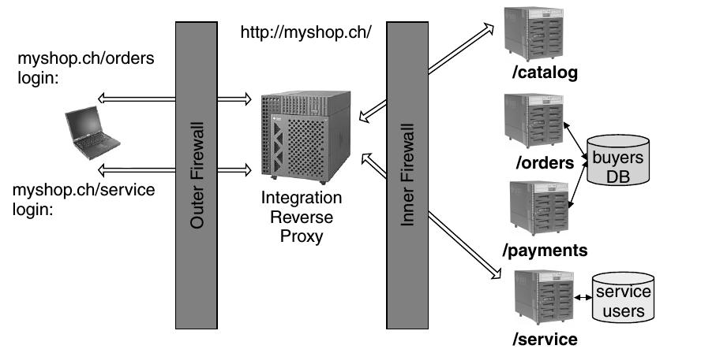
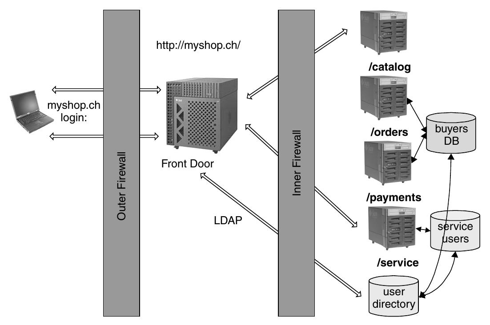

===============
13.7 Front Door
===============

"Front Door" ist eine Variante des "Integration Reverse Proxy". 
Authentication und Session Management werden durch den Proxy für 
alle dahinter stehenden Applikationen übergreifend verwaltet.

Context
=======

Ein Web-Service, aufgebaut aus mehreren Servern und Services/Backend Applications, die User Authentication benötgen.

Problem
=======

* Single Sign On / Single Log Off über mehrere Services und Applications hinweg gewünscht
* Services besitzen eigene User Daten
* Proxy soll Kontrolle über Session, Sessiontimeout, etc. besitzen
* Einfache Integration in bestehende Umgebung

Solution
========

Ein "Integration Reverse Proxy" wird als "Front Door" eingesetzt. 
Er identifiziert User, verwaltet Sessions und übergibt diese Informationen den einzelnen Services.
"Front Door" bezieht die User und Rechte Informationen von den einzelnen Services und wendet diese an.

   "Front Door" zieht die Userinformation aller Services zusammen und wendet entsprechende Zugriffsregeln an.
   

Normalerweise wird "Front Door" in der DMZ platziert.

Dynamics
--------

"Front Door" überprüft bei jedem Zugriff die Rechte des zugreifenden Users und leitet nur 
berechtigte Zugriffe an die Services weiter, zum Login Service oder zu einer Error Seite, 
wenn der User keine Zugriffsrechte besitzt. 

Implementation
--------------

1) Benutzer- und Rechtedatenbanken auf eine einheitliche Basis bringen, damit ein Austausch möglich ist
2) Authentication Mechanismen definieren
3) Zugriffsrechte Schemas definieren falls notwendig
4) User und Session Repräsentation entwerfen, wie sie von den Services verwendet werden
5) Entwerfen, wie "Front Door" User und Sessions trackt, z.B. über die SSL Session ID
6) "Front Door" Session Context umsetzen, z.B: Cookie Machanismen
7) Zusammenarbeit zwischen "Front Door" Cookies und Service Cookies umsetzen
8) Login Mechanismus entwerfen und umsetzen

Varianten
---------

* Zwei "Front Door"s, eine für Public Pages/Services und eine für Services mit Authentication

Closure
=======

✔ SSO für alle Services, Zentraler Login/Logout

✔ Keine Redundaten User Profile über die Services verstreut (da sie durch die Front Door gemappt werden)

✔ Services müssen sich nicht um Authentication und Login kümmern

✗ Applikationen besitzen weiterhin ihre eigenen User Datenbanken -> Gefahr von Inkonsistenzen

✗ Ein Zentrales User Management wird benötigt, damit nicht über die Services hinweg User Profile gewartet werden müssen

✗ Passwort/Session Timeout Policies der einzelnen Services können in Konfllikt stehen

Verwandte und Verwendete Patterns
=================================

* Verwendete: 
  * Integration Reverse Proxy
  * Check Point
  * Security Session
  * Single Access Point

Prüfungsfragen
==============

a) "Front Door" authentisiert User und managt Sessions für mehrere Backend-Applikations/Services.
b) "Front Door" baut eine zentrale User Datenbank auf und ersetzt damit die Userdatenbanken der Services.
c) "Front Door" ermöglich zwar SSO, das User Management ist jedoch nach wie vor eher wartungsfeindlich.

Antworten zu den Fragen
=======================

a) Richtig.
b) Eben nicht. "Front Door" zieht die User Informationen aus den Datenbanken der einzelnen Servies zusammen. Diese werden weiterhin durch die einzlenen Services "gehostet".
c) Richtig, weil die User über die User Datenbanken der einzelnen Services verstreut sind.