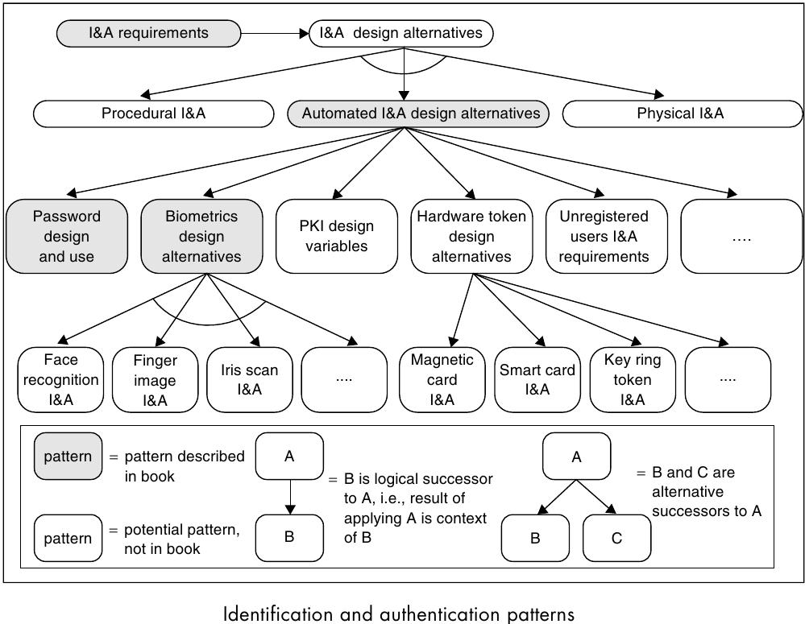
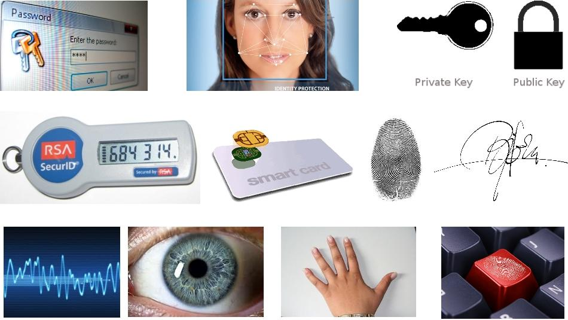

===================================
5.2 Identification & Authentication
===================================

Identtifizierung und Authentisierung setzen sich aus verschiedenen Verfahren und Vorgehensweisen zusammen. Die folgende Grafik zeigt verschiedene Patterns, die sich mit Identifizierung und Authentisierung befassen.

Die Hauptaufgabe von I&A ist es, ein Element (Benutzer, Prozess, ...) (wieder)zuerkennen und seine Identität sicherzustellen.

* Automatisierte I&A, z.B: Login mit Benutzername & Passwort
* Physikalische I&A, z.B. Identitätskartenüberprüfung
* Prozedurale I&A, z.B. Loginprozedere

Verfahren
=========

* Passwort
* Biometrische Mechanisme
	* Gesichtserkennung
	* Fingerabdruck
	* Handform
	* Eigenschaften des Auges
		* Iriserkennung (Analyse des Farbrings um die Pupille)
		* Retina Scan (Analyse des Blutbahnenmuster des Innenauges)
	* Unterschrifterkennung
	* Spracherkennung
* Public Key (PKI)
* Hardware Tokens
	* Magnetkarten & PIN
	* One TIme Password (OTP) Tokens
	* Smart Card
* I&A ohne explizite Regisitrierung (z.B. über Verhalten, E-mail Adresse, ...)
* I&A mit expliziter Registrierung

	

