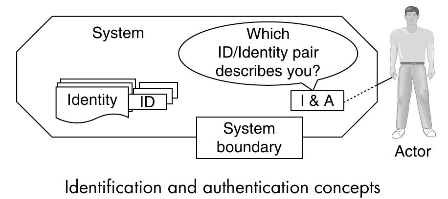
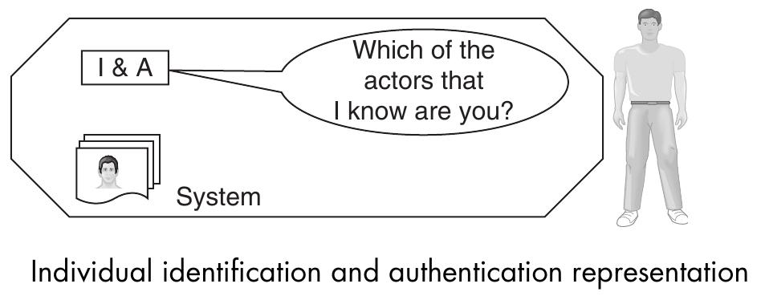
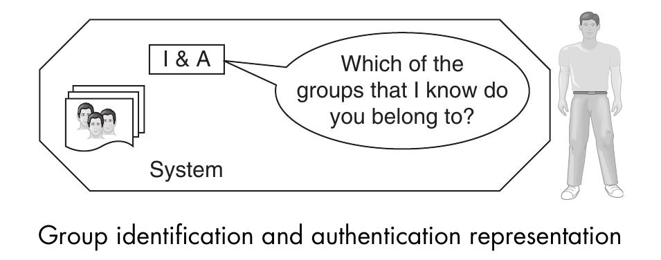
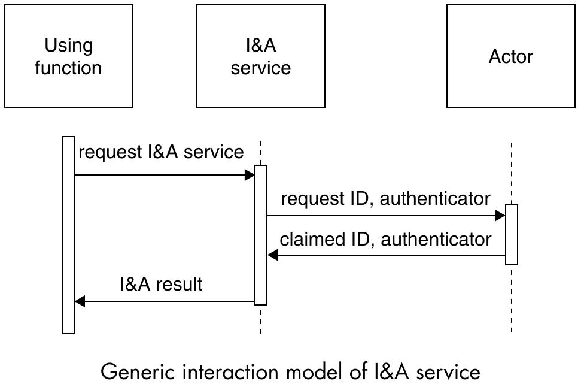
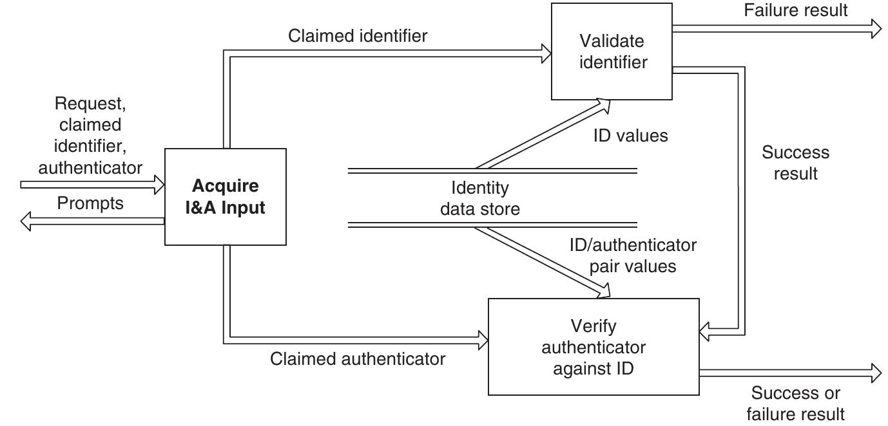

===================================
7 Identification & Authentication
===================================

Identifizierungs- & Authenifizierungsservices haben die Aufgabe, Aktoren (wieder)zuerkennen, die mit einem System interagieren möchten.

Aktoren können Benutzer, Prozesse oder Entitäten darstellen.

   Das I&A System ist im Besitzt der Identität des Aktors. Es übersetzt die Identität in eine ID und authentisiert die ID über einen Authentisierer.

Typen von I&A
=============

**Beispiel aus dem realen Leben**: Der Türsteher einer geschlossenen Gesellschaft identifiziert den Gast und überprüft, ob sein Name auf der Liste steht. Der Türsteher interessiert sich für die Identität des Gastes.

**Beispiel aus dem realen Leben**. Der Türsteher eines Clubs überprüft, ob das Gesichter auf der Identitätskarte zum Gast gehört und ob der Gast alt genug ist. Der Türsteher interessiert sich für die Gruppenzugehörigkeit (18+) und nicht für die Identität des Gastes.

I&A Interaktion
===============

* **Using function**: eine Software Funktion, eine Person, die an einen Schalter tritt, ...
* Varianten:
	* Der aufrufende Prozess (Using function) bringt bereits alle Information mit, der I&A Service reicht diese direkt an den Actor durch und erhält als Antwort Accountinformationen
	* Der aufrufende Prozess liefert lediglich eine ID o.Ä., der I&A Service mappt diese mit weiteren Benutzerinformationen und sendet die Anfrage an den Actor.
	
	
Interner Aufbau
===============

Der Anfrager liefert entweder ein Authenticator (Echtheitsbeglaubigung) oder ein Identifier. Während der Authenticator direkt mit den Datensätzen aus der Datenbank verifiziert werden kann, muss ein Identifier zuerst auf Existenz überprüft werden.

