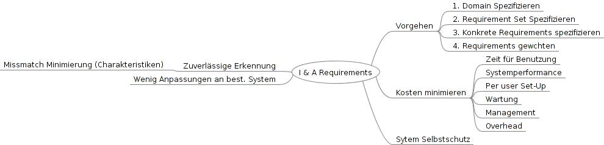

================================================
7.1 Identification & Authentication Requirements
================================================

I&A soll Individuen (User, Prozesse, Entitäten) erfassen und deren Identität überprüfen.

Problems
========

* Die einzelnen Anforderungen stehen sich z.T. gegenüber. Hier muss den für den aktuellen Fall besten Mittelweg ermittelt werden
	* z.B. Hohe Sicherheit <-> Einfach benutzbar
* Die Erkennung eines Benutzers (Identifikation) und die Identitätsüberprüfung (Authentication) müssen zuverlässig funktionieren ansonsten
	* werden unerlaubte Benutzer zugelassen -> Information Leak
	* werden berechtigte ausgesperrt -> Produktivitätsverlust 
* Es braucht
	* Ein spezifisches Set von Anforderungen für den konkreten Fall
	* Eine Gewichtung der Wichtigkeit der einzelnen Anforderungen für den konkreten Fall
* Der I&A Service muss sich selbst gegen Angriffe verteidigen / schützen

Solution
========

   I&A Requirements

* Eine hohe Erkennungsrate von unerlaubten Zugreifern erhöht auch die Rate der unschuldig gesperrten!
	

Closure
=======

* (+) Explizite Definition der Domain und Requirements
* (+) Verständnis über den Scope jedes Requirement Sets
* (-) Gefahr von Overengineering
* (-) Der Formale Evaluationsprozess kann zu lang und zu teuer sein
* (-) Umfangreiche Requirements Dokumentation muss gewartet werden

Prüfungsfragen
==============

a) Eine höhere Erkennungsrate von "Nicht Berechtigten" Zugriffen erhöht auch die Rate der Berechtigten, die versehentlich geblockt werden.
b) Mit Benutzer Charakteristiken wird z.B. der Standort des Benutzers einbezogen um die Zugriffserlaubnis Ortsabhängig zu machen.
c) Um die Requirements für einen konkreten Fall zu spezifizieren, werden
	1) die Domain spezifiziert
	2) das passende Requirements Set spezifiziert
	3) die konkreten Requirements spezifiziert
	4) die Requirements gewichtet

Antworten zu den Fragen
=======================

a) richtig.
b) falsch. Mit Benutzer Charakteristiken wird ein Nutzungsprofil erstellt. Passt ein aktueller Zugriff nicht ins Profil, handelt es sich um einen potentiellen Imposter (Identitäts-Vortäuscher).
c) richtig