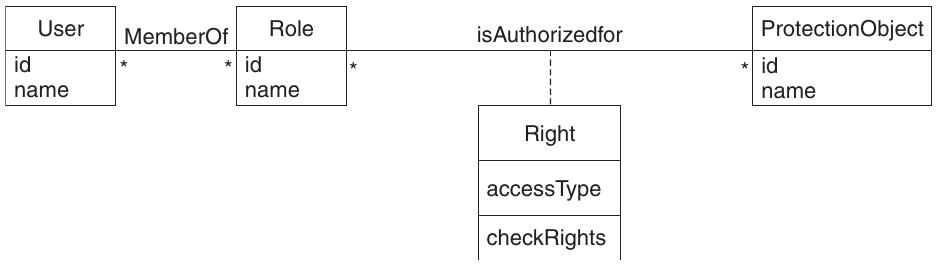
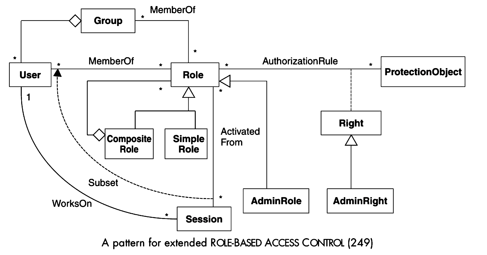

=============================
8.2 Role based access control
=============================

Summary
=======

Beschreibt, wie Rechte basierend auf Rollen oder Funktionen zugewiesen und verwaltet werden können. Eignet sich darum für komplexere Rechteverwaltungen, die trotzdem einfach einzurichten sind.

Context
=======

Umgebungen mit Resourcen, deren Zugriff anhand von Rollen oder Aufgaben an User vergeben werden soll und dessen einzelne Konfiguration Zeitaufwändig wäre, besonder bei einer grossen Zahl von Benutzern und Resourcen.

Problem
=======

Komplexe Abbildungen von Rechten mit vielen Usern und Rollen sind mit dem Authorization Pattern zwar möglich aber umständlich und fehleranfällig. Das kopieren von ähnlichen Rechteprofilen sollte vermieden werden:

* Benutzer können meist in Gruppen mit ähnlichen Aufgaben eingeteilt werden
* Ähnliche Aufgaben erfordern ähnliche Berechtigungen
* Organisationen sollten unterstützt werden, für ihre Benutzer die richtigen Rechte poliygetreu zu definieren

Solution
========

   Klassenmodell für Rollenbasierte Zugriffskontrolle

"Role Based Access Controll" implementiert das "Authorization Pattern" und erweitert den Benutzer um Rollen. Benutzer werden nicht mehr direkt mit Resourcen verknüpft sonder sind Rollen zugeordnet, die mit den Resourcen verknüpft sind.

   Erweiterte Rollenbasierte Zugriffskontrolle
   
   
Sollen nebst Rollen auch Gruppen und Sessions zum Zuge kommen und verschiedene Arten von Rechten zum Einsatz kommen, so bietet sich "Extened Role based Access Controll" an.
Benutzer sind Gruppen und Rollen zugeteilt, sodass sowohl einzelne Benutzer wie ganze Benutzergruppen mit Rollen verknüpft werden können. Rollen wiederum können aus Subrollen bestehen.
Um die Rechte verwalten zu können, wird ein spezielle Rolle, die "Admin Rolle", benötigt, die wiederum spezielle Rechte, die "Admin Rechte", notwendig macht.

Closure
=======

"Role based Access Control" erweitert das "Authorization Pattern" um Rollen. Für die Praxis wird das Extended Model allerdings relevanter sein, da Kaskadierende Rollen sowie Gruppen und Sessionen in den meisten Organisationen benötigt werden um deren Strukturen abzubilden.

 
