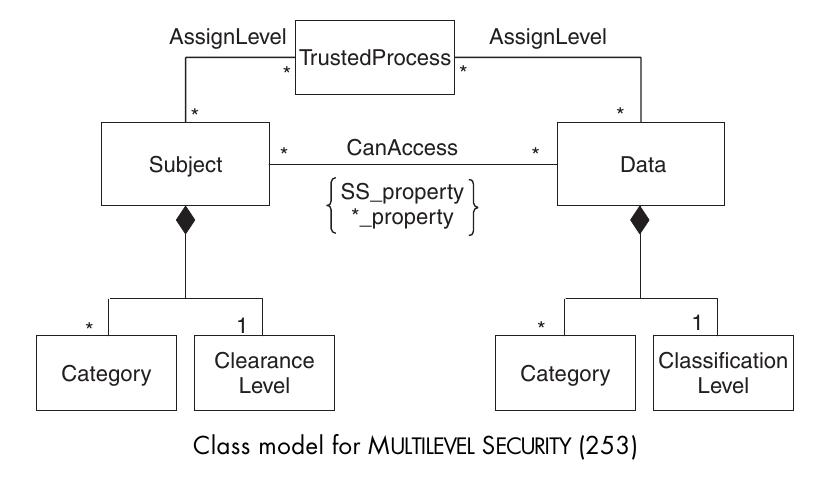

===========================
Multilevel Security Pattern
===========================

Beschreibt, wie ein Sicherheitskonzept aufbauend auf Sicherheitslevels und Zugriffslevels aufgebaut werden kann um sensitive Daten zu schützen und Leaks zu verhindern.

Context
=======

Umgebungen mit sicherheitskritischen Daten, z.B. Militätr.

Problem
=======

* Schutz und Integrität von Daten basierend auf deren Vertraulichkeit
* Die Fähigkeiten eines Benutzers müssen angehoben oder verringert werden können
* Benutzer müssen basierend auf ihren Rang oder Position Zugriff erhalten

Solution
========

User wie Daten werden gruppiert und klassifiziert.
Aufgrund dieser klassifizierung erhält ein User Access oder nicht.

Die Klassifizierung erfolgt durch eine vertrauliche Stelle oder einen vertraulichen Prozess.
Für neue Elemente wird eine Standardklassifizierung berechnet, aus den Referenzen zu andern Daten und Usern.

Eine offene Frage bleibt der Sinn der CanAccess Verbindung, da dies über die Levels bereits abgedeckt wird. 

Closure
=======

Diese Art der streng-hierarchischen Zugriffskontrolle funktioniert nur in entsprechend funktionell-hierarchisch aufgebauten Organisationen.

In gewöhnlichen Firmen und Organisation wird es schwierig die Dokumente und Mitarbeiter zu klassifizieren, weil Mitarbeiter weiter unten in der Hierarchie unter Umständen gleiche Zugriffsrechte wie ihr Chef besitzen müssen um vernünftig arbeiten zu können.

Es wird eine Stelle benötigt, die in jedem Fall vertraulich ist und die Zugriffslevel und Klassifizierung definiert.

Prüfungsfragen
==============

a) Das "Multilevel Security" Pattern eignet sich schlecht für stark hierarchische strukturen wie das Militär, weil untergebene zu Einsicht in vertrauliche Dokumente einer höheren Stufe erhalten würden.
b) Das "Multilevel Security" Pattern verwendet Rollen als Basismodel für Sicherheitslevel.
c) Die direkte Beziehung "CanAccess" zwischen User und Objekt dient dazu, für den Notfall Ausnahmen definieren zu können.

Antworten zu den Fragen
=======================

a) falsch. Es eignet sich gerade dafür weil die Zugriffsvergabe streng nach Hierarchie und Position funktioniert.
b) falsch. Es werden "Clearance-" und "Classification Levels" benutzt.
c) falsch. 