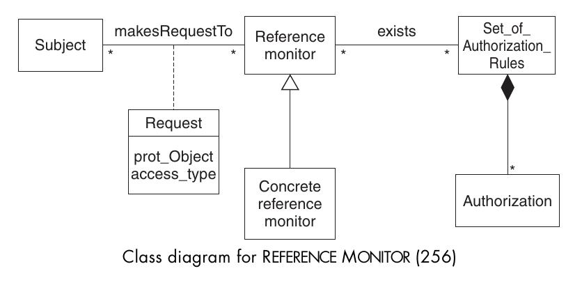
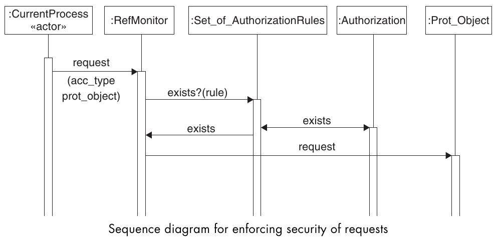

=========================
Reference Monitor Pattern
=========================

Beschreibt, wie User Zugriff auf Objekt mittels Erlaubniserteilung erhalten.

Context
=======

Umgebungen, in denen Erlaubnisanfragen von Benutzern oder Prozessen für Daten anfallen.

Problem
=======

Rechtesysteme ohne Erlaubniserteilung basieren auf freiwilligkeit und funktionieren somit so gut wie wenn es fehlt.

Es wird eine Kontrollstelle benötigt, die Zugriffsanfragen abhandelt und anhand von definierten Regeln Zugriff erteilt.

Solution
========

Benutzer oder Prozesse stellen Anfragen an "Reference monitor". Dieser überprüft, ob es eine Authorisierungsregel für diesen Benutzer auf diesen Prozess gibt und erteilt Zugriff wenn die Regel exisitiert.

Nach diesem Prinzip funktioniert z.B. der Filezugriff bei den meissten Dateisystemen. Das Betriebsystem schaut in den Zugriffsrechten der Datei oder Rechtetabellen nach, ob der Anfragende Benutzer zugreifen darf.

Closure
=======

Zugriff über "Reference Monitor" funktioniert nur, wenn alle Zugriffe über diesen ablaufen. Gibt es Beipässe, so ist das System nutzlos.

Da der "Reference Monitor" bei jedem Zugriff die Rechte überprüfen muss, kann diese Stelle zum Flaschenhals werden und auf die Performance zum System drücken.

Prüfungsfragen
==============

a) "Reference Monitor" setzt eine Zugriffskontrolle nach dem Schema Anfrage-->Zugriff/Kein Zugriff um.
b) Ist z.B. bei einem Dateisystem direkter Zugriff ohne über die BS-Schnittstelle zu gehen möglich, so ist der Dateizugriffsmanager sinnlos weil es einen Bypass gibt.
c) Benutzer fragen Zugriff direkt beim entsprechenden Objekt nach, dieses schaut in die Zugriffsliste und gibt sich selbst frei.

Antworten zu den Fragen
=======================

a) richtig
b) richtig.
c) falsch.