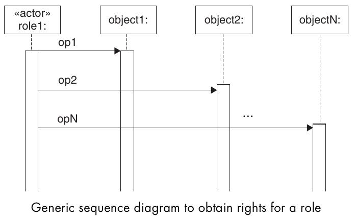
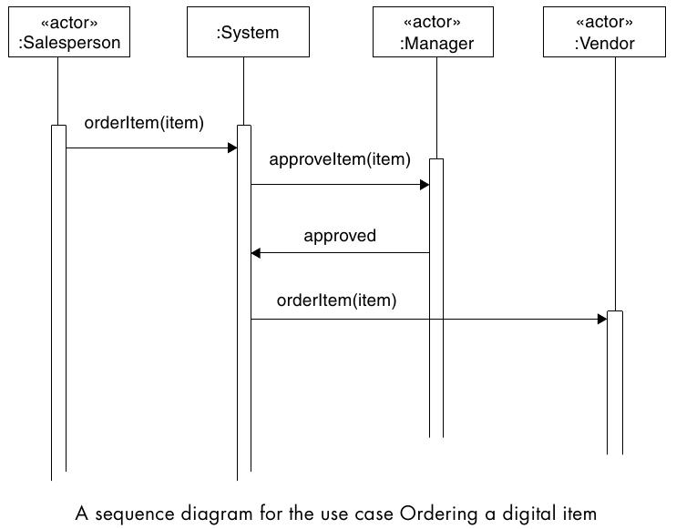

==============================
Role Rights Definition Pattern
==============================

Beschreibt, wie Rollen Rechten zugeteilt werden sollen, sodass die Rechte nach dem Prinzip der minimalen Privilegien vergeben sind.

Problem
=======

* "Role Based Access Control" definiert zwar ein technisches Model für eine Rollen basiertes Rechtesystem aber nicht, woher die Rechte einer Rolle herkommen. 
* Das Definieren von Rollen und deren zugehörige Rechte ist ein komplexer Prozess. Rollen gehören zu bestimmten Prozessen in Organisationen und die User einer Rolle benötigen bestimmte Rechte um ihre Aufgaben erledigen zu können.
* Rollen können sich ändern, die Rechte sollten sich anpassen
* Rollen müssen implementationsunabhängig sein

Solution
========

* Sequenzdiagramme für jede Rollen und jeden Anwendungsfall erstellen
* Anhand dieser SD's ist ersichtlich, welche Operationen für eine Rolle notwendig sind und auf welche Objekte Zugriff benötigt wird. (Die Rollen können automatisch aus den Diagrammen generiert werden.)
* Anwendungsfälle werden als ganzes zu Rollen hinzugefügt oder entfernt und mit ihnen Rechte für Operationen und Resourcen.

Closure
=======

Für das Ermitteln der minimalen Rechte ist es notwendig, die Abläufe im gesammten System in Form von Use Cases auszuwerten, was sehr aufwendig ist.

Prüfungsfragen
==============

a) "Role Rights Definition" beschreibt, wie für das Prinzip der "minimalen Einschränkungen" Rollen definiert werden.
b) "Role Rights Definition" erforder, das jeder Anwendungsfall für jede Rolle in der Organisation analysiert wird.

Antworten zu den Fragen
========================

a) falsch. Es geht um "minimale Privilegien".
b) richtig. Die für den Anwendungsfall notwendigen Operationen und Rechte definieren die minimal notwendigen Privilegien um diesen auszuführen.
