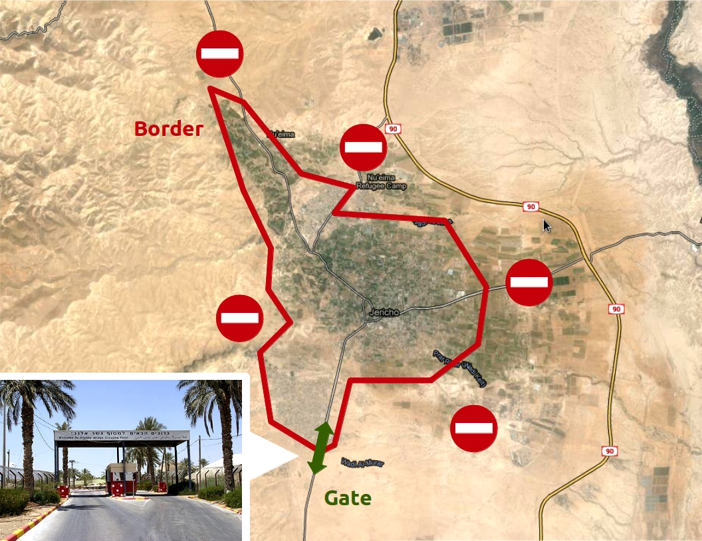
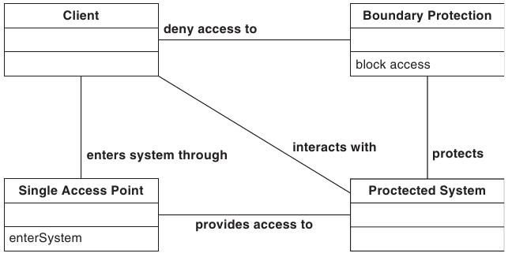
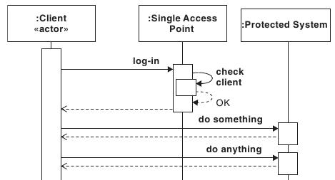

=======================
9.2 Single Access Point
=======================

Ein "Single Access Point" erteilt oder verbietet Zugang zu einem System nach dem er die Zugangsanfrage eines Clients überprüft hat. Der "Single Access Point" stellt den Einstiegspunkt für ein System dar.

Context
=======

Externen Clients benötigen Zugang zu einem System. Gleichzeitig muss Missbrauch oder Beschädigung des Systems vorgebeugt werden.

Problem
=======

* Es braucht eine Komponente, die die jede Interaktion eines externen Clients überprüft und feststellt, ob dieser dazu berechtigt ist.
* Implementiert jede Komponente im System den Zugriff selbst, so
	* führt dies zu Redundanz im Code
	* führt dies zu Inkonsistenz
	* ist es schwierig, eine korrekte und übergreifende Einhaltung der Policy zu gewährleisten
	* würden wiederholte Checks für ähnliche Operationen das System verlangsamen
* Mehrere Einstiegspunkte reduzieren die Sicherheit, weil die Komplexität zunimmt

Solution
========

   Die niedrigst liegende Stadt der Welt wird geschützt durch Zäune und Barrieren. Für den Zugang sorgt ein einziger "Access Point" an der Hauptstrasse.

   
   Schematisches Zusammenspiel von Client, Boundary Protection, Single Access Point und System

Access Point
------------

   Erst nachdem der Access Point den Client überprüft hat, erhält dieser Zugang zum Systems

* Überprüft die Legitimität des Clientzugriffs anhand der Policy.
	* Lässt berechtigte Clients hinein
	* Verhindert unberechtigte Eindringlinge
* Muss gut erkennbar und erreichbar sein
* Ist Auditing erforderlich, so kann der AP Zugriffsaktivitäten aufzeichnen

Boundary / Systemgrenze
-----------------------

* Muss vor Zugriffen geschützt werden
	* Ansonsten verliert der AP seinen Sinn -> Verhindert Umgehung des AP

Implementation
==============

1) Definition der Security Policy
	* Was wird geschützt und wozu
	* Enthält die vertrauenswürdigen Beziehungen zwischen Subkomponenten
	* Die Subkomponenten müssen dem AP und einander vertrauen
2) Definition eines gut erreichbaren Access Points
	* Möglich ist auch ein unsichtbarer Access Point, der nicht umgangen werden kann (Bsp. Auto Redirect zum Login Window)
3) (Optional) Der AP implementiert den Zugriffscheck selbst
4) Umsetzung der Systeminitialisierung beim AP
5) Schutz der restlichen Systemgrenzen

Known Uses
==========

* Betriebsystem Login
* HSR Login

Conclusion
==========

✔ Eine einzelne Stelle um das System zu bewachen ist notwendig

✔ Die innere Struktur des System wird einfacher, weil nicht jede Komponente eigene Zugriffchecks machen muss

✔ Keine redundanten Authorisierungschecks

✗ Ein einziger Zugangspunkt für das System kann die Benutzbarkeit verschlechtern oder verunmöglichen

✗ Dem Gate Keeper und der Boundary Protection muss absolut vertraut werden

✗ Clients werden allenfalls zu streng durchgecheckt für die Aufgabe, die sie durchführen wollen

✗ Single Point of Failure

Prüfungsfragen
==============

a) Access Point und Boundary sollen Benutzer am unberechtigten verlassen des Systems hindern.
b) Ohne Boundary ist ein "Single Access Point" nutzlos.
c) Ein "Single Access Point" erschwert die Umsetzung der Policy.

Antworten zu den Fragen
=======================

a) Nein. Umgekehrt. Eindringlinge sollen abgefangen werden.
b) Ja. Er kann einfach umgangen werden.
c) Nein. Eben nicht. Der AP vereinfacht die Umsetzung, da nur eine Stelle dafür zuständig ist.

