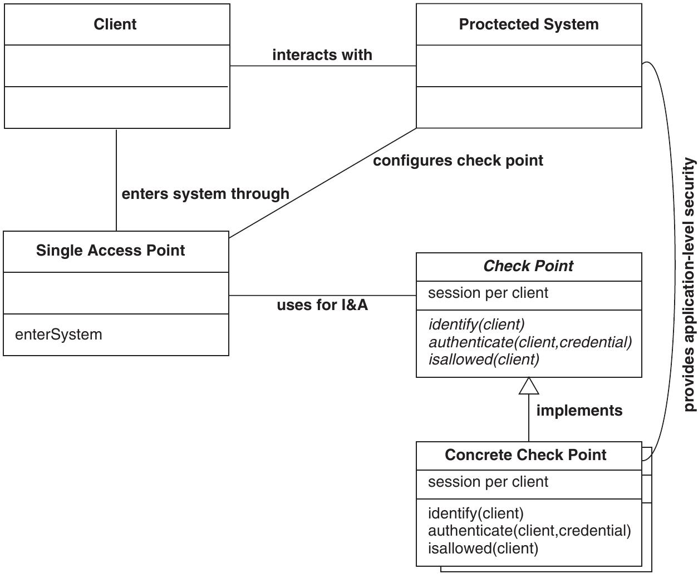
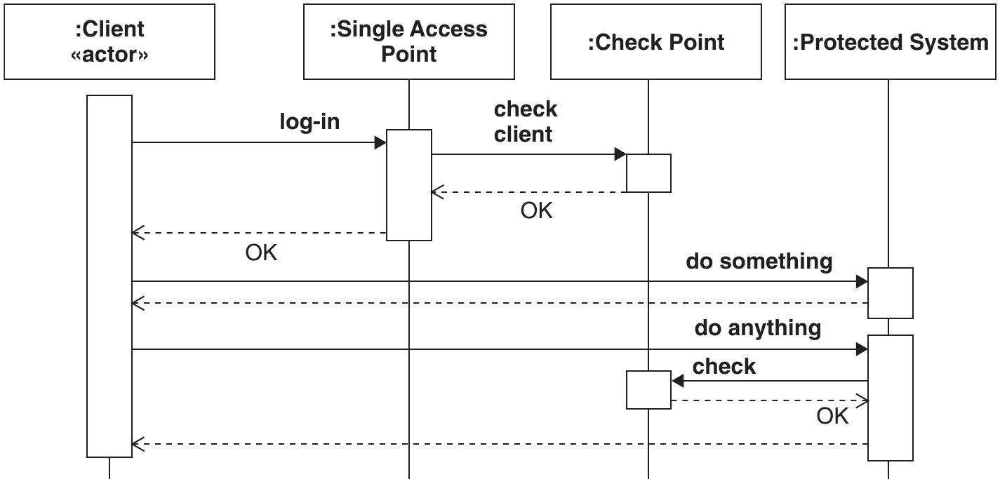

===============
9.3 Check Point
===============

Checkpoint stellt einen konkreten "Identification & Authentication" und "Access Control Mechanismus" für den "Single Access Point" zur Verfügung. Auch genannt Policy Enforcement/Definition Point.

Context
=======

Ein System, das durch einen "Single Access Point" vor unberechtigtem Zugriff geschützt wird und berechtigte Zugriffe ermöglicht werden sollen.

Problem
=======

* Das System muss vor Einbrüchen geschützt werden
* Berechtigte Zugriffe sollten so wenig wie möglich behindert werden

Wie kann eine Architektur effektiven Schutz und gleichzeitig flexible Schutzmechanismen bieten, ohne das zu schützende System zu gefähreden?

* Users müssen authentifiziert und authorisiert werden
* Userfehler müssen sinnvoll abgefangen werden, sodass User nicht unnötig ausgesperrt werden.
* Checks über das ganze System zu verstreuen würde die Komplexität und Fehleranfälligkeit erhöhen und die Performance verschlechtern.
* Die Schutzstrategie genug Flexibel sein, um nachträgliche Anpassungen problemlos umsetzen zu können
* Security-Komponenten sollten wiederverwendet werden können

Solution
========

Konkrete Schutzstrategien werden in Form von Strategien umgesetzt (Strategy Pattern), sodass sie flexibel eingesetzt werden können.

Check Point definiert das Interface, welches die konkreten Strategien implementieren ud vom "Single Access Point" genutzt wird.

* Ein Wechsel der Konfiguration und des konkreten Check Points verändert das Verhalten des "Single Access Points".
* Der Konkrete Check Point kapselt die Security Policy.

Struktur
--------

   "Single Access Point" Benutzt den "Check Point" für I & A. Dieser setzt die Policy um.

I & A Ablauf
------------

   Clients loggen sich beim "Singe Access Point" ein, dieser lässt den "Check Point" die Zugriffserlaubnis prüfen und lässt berechtigte Clients ins System hinein. Auch Systemkomponenten können beim "Check Point" Berechtigungen überprüfen lassen.

Umsetzung
---------

1) Check Point Interface definieren (abstract Strategy)
	* Stellt Hooks für I & A, Authorisierung und Errorhandling bereit
2) Entry-Check ("Check Point2 Initialisierung) in den "Single Access Point" integrieren -> Zugriffscheck an "Check Point" delegieren
3) Konfigurationsmechanismus für die Auswahl eines konkreten "Check Points" zur Verfügung stellen
	* Konfiguration muss ebenfalls geschützt werden
4) Benötigten konkreten "Check Point" implementieren
	* "Null Check Point" (Null Object) kann ein hilfreicher konkreter "Check Point" für die Entwicklungsphase des Systems sein
5) Errorhandling umsetzen
	* Client Errors können anhand von Merkmalen Sicherheitsstufen zugeordnet werden -> Schwere des Errors legt fest, wie stark/lange der Client geblockt wird (Policy)
	* 
		.. figure:: img/9.3.3.jpg
		
		   Beispiel einer Fehlerbehandlungsstrategie

6) Für den "Check Point" eine API auf Application level zur Verfügung stellen
	* Können Checks nicht beim Eintritt ins System gemacht werden, so müssen diese an die Applikation delegiert werden können
	* Benutzung von wiederverwendbaren Sicherheitskomponenten
	

Closure
=======

✔ Alle Aspekte der Securitypolicy sind an einem Ort umgesetzt

✔ Die Umsetzung der Policy ist Flexibel und lässt Änderungen zu

✔ Testing und Entwicklung, insbesondere unabhängiges Testing der Umsetzung der Policy durch den "Check Point" wird einfacher

✔ Wiederverwendung von Sicherkeitskomponenten (z.B. OpenSSL)

✗ Konkrete "Check Point" Implementation können Verletzlichkeiten ins vermeindlich sichere System einbringen

✗ Komplexes Error Handling

✗ Komplexe Zustände für Checks, die nicht beim "Single Access Point" gemacht werden können (z.B. isolate)

✗ Komplexes Interface und komplexe Konfiguration

Prüfungsfragen
==============

a) "Check Points" stellen konkrete Implementationen der Policy zur Verfügung und werden vom "Single Access Point" benutzt für I&A
b) Ein "Check Point" kann "Null Object" implementieren um die Entwicklung des geschützten Systems zu vereinfachen
c) "Check Points" sollten autarke Komponenten sein, die nicht auf andern Modulen basieren.

Antworten zu den Fragen
=======================

a) Richtig
b) Richtig
c) Falsch. "Check Points" sollen nach Möglichkeit wiederverwendbare Security Komponenten wie z.B. OpenSSL verwenden anstelle eigener Implementation von Sicherheitsalgorithmen.

