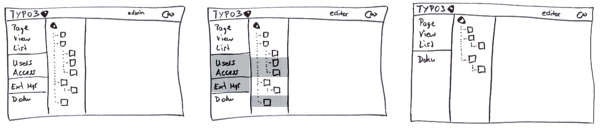

==================
9.6 Limites Access
==================

User Interfaces sollen Benutzer nur die Aktionen anzeigen, für die sie auch Zugriffsrechte besitzen.

Context
=======

Systeme mit Zugriffsbeschränkungen, die sich auf das User Interface auswirken sollen.

Problem
=======

* Benutzer soll es egal sein können, ob Funktionen existieren, für die sie keine Rechte besitzen
* Benutzer mit stark eingeschränkten Rechten können verwirrt werden, wenn viele nicht benutzbare Funktionen angezeigt werden

Darum sollten Benutzer

* Aktionen nicht sehen, für die sie keine Rechte besitzen
* Keine Daten sehen, für die sie keine Rechte besitzen
* Nicht mit Errormeldungen darauf hingewiesen werden, das sie keine Rechte für eine Funktion besitzen

Lösung
======

Im User Interface werden nur Operationen und Daten angezeigt, für die der Benutzer auch Rechte besitzt. Das Benutzerinterface ist verantwortlich für die Überprüfung der Benutzerrechte bevor das Interface gerendert wird.

.. figure:: img/9.6.1.jpg

   Der InterfaceBuilder überprüft die Rechte des Benutzers und rendert nur verfügbare Operationen.

Implementation
==============

1) Verknüpfung zwischen Benutzer und Rechten umsetzen.
	* Wird **Check Point** eingesetzt, so kann dessen Interface benutzer werden anstellen eigener Check-Funktionalität
2) User Interface Designen und Elemente mit Zugriffsrechten verknüpfen
	* Für sehr komplexe Regeln eignet sich **Full Access With Errors** besser, da ansonsten die UI Logik extrem umfangreich wird.
	* Möglicherweise ist es am einfachsten, für jede Rolle ein angepasstes User Interface zuer Verfügung zu stellen, statt das UI auf den User spezifisch zuzuschneidern
3) Entscheiden, wie verfügbare und nicht verfügbare UI Elemente dargestellt werden
4) Sicherheit überprüfen. Obwohl der Benutzer nur verfügbare Operationen aufrufen kann, kann es sein das trotzdem jede Operation die Berechtigungen überprüfen muss.
	* z.B. bei Web Applikationen oder verteilten Systemen
	* Kombination von **Limited Access** und **Full Access with Errors**

   Beispiel mit TYPO3 CMS: Admin View, Editor View (Full Access with Errors), Editor View (Limited Access) im Vergleich (von links nach rechts)
	

Closure
=======

✔ User sehen nur verfügbare Operationen

✔ Benutzer werden nicht durch unnötig viele Elemente verwirrt

✔ Falls das System nur über das UI ansteuerbar ist, 
	* können Sicherheitschecks einfacher umgesetzt werden
	* müssen Entwickler sich nicht um Rechteüberprüfungen kümmern für jede Operation
	
✗ User können verwirrt werden, wenn UI Elemente verschwinden und erscheinen, abhängig vom Kontext

✗ Das UI kann unter Umständen schlecht aussehen, weil viele leere Flächen enthalten sind

✗ Dokumentation und Anleitungen müssen für verschiedene UI Zustände geschrieben werden

✗ **Limited Access** in ein bestehendes System einzupflegen ist aufwendig

✗ Zugriffsrechte nur im UI zu überprüfen ist sehr gefährlich (Security by Obscurity), insbesondere Webapplications sollten serverseitig jegliche Rechte erneut überprüfen

